# CRM Web Application - Análisis Exhaustivo

## Índice
1. [Instalación y Configuración](#1-instalación-y-configuración)
2. [Análisis Arquitectónico y Estructural](#2-análisis-arquitectónico-y-estructural)
3. [Análisis de Lógica de Negocio por Módulo](#3-análisis-de-lógica-de-negocio-por-módulo)
4. [Diagramas de Flujo](#4-diagramas-de-flujo)
5. [Análisis de Servicios y API](#5-análisis-de-servicios-y-api)
6. [Análisis de Componentes Reutilizables](#6-análisis-de-componentes-reutilizables)
7. [Integraciones Externas](#7-integraciones-externas)
8. [Casos de Uso de Negocio](#8-casos-de-uso-de-negocio)
9. [Diagrama de Entidades y Relaciones](#9-diagrama-de-entidades-y-relaciones)
10. [Análisis de Estados y Workflows](#10-análisis-de-estados-y-workflows)
11. [Resumen Ejecutivo](#11-resumen-ejecutivo)
12. [Análisis Profundo: Módulo Applications](#12-análisis-profundo-módulo-applications)
13. [Flujos Completos de Procesos - Trazabilidad Detallada](#13-flujos-completos-de-procesos---trazabilidad-detallada)
14. [Análisis de Arquitectura Completa](#14-análisis-de-arquitectura-completa)

---

## 1. INSTALACIÓN Y CONFIGURACIÓN

### 1.1 Requisitos Previos

Para levantar este proyecto necesitas tener instalado:

- **Node.js**: Versión 18.x o superior
- **npm**: Versión 9.x o superior (viene con Node.js)
- **Angular CLI**: Se instala automáticamente como dependencia del proyecto

### 1.2 Instalación

#### Paso 1: Clonar el Repositorio

```bash
git clone https://github.com/Abrahan-Eagle/crm-web-app.git
cd crm-web-app
```

#### Paso 2: Instalar Dependencias

```bash
npm install
```

Este comando instalará todas las dependencias necesarias:
- Angular 19.1.4 y sus módulos
- Auth0 SDK para autenticación
- NotificationAPI SDK para notificaciones
- Tailwind CSS para estilos
- Otras dependencias del proyecto

**Nota**: La primera instalación puede tardar varios minutos dependiendo de tu conexión a internet.

#### Paso 3: Configurar Variables de Entorno

Crea un archivo `src/environments/environment.ts` basándote en `src/assets/env.sample.js`:

```typescript
export const environment = {
  production: false,
  AUTH0_DOMAIN: 'tu-dominio.auth0.com',
  AUTH0_CLIENT_ID: 'tu-client-id',
  AUTH0_AUDIENCE_DOMAIN: 'tu-audience',
  AUTH0_CONNECTION: 'tu-connection',
  BASE_API: 'http://localhost:3000', // URL de tu backend API
  NOTIFICATION_API_CLIENT_ID: 'tu-notification-api-client-id',
  NOTIFICATION_API_USER_ID: 'tu-user-id'
};
```

### 1.3 Levantar el Servidor de Desarrollo

#### Opción 1: Usando npm (Recomendado)

```bash
npm start
```

Este comando ejecuta `ng serve` que:
- Compila la aplicación Angular
- Inicia el servidor de desarrollo en `http://localhost:4200`
- Habilita hot-reload (recarga automática al cambiar archivos)
- Muestra errores de compilación en la consola

#### Opción 2: Usando Angular CLI directamente

```bash
npx ng serve
```

O si tienes Angular CLI instalado globalmente:

```bash
ng serve
```

#### Opción 3: Levantar en segundo plano

Si quieres que el servidor corra en segundo plano:

```bash
npm start &
```

Para detener el servidor en segundo plano:

```bash
pkill -f "ng serve"
```

### 1.4 Acceder a la Aplicación

Una vez que el servidor esté corriendo, verás un mensaje similar a:

```
✔ Browser application bundle generation complete.

Initial Chunk Files   | Names         |  Size
main.js              | main          |  XXX kB

** Angular Live Development Server is listening on localhost:4200, open your browser on http://localhost:4200/ **
```

Abre tu navegador en: **http://localhost:4200**

### 1.5 Scripts Disponibles

El proyecto incluye los siguientes scripts en `package.json`:

| Script | Comando | Descripción |
|--------|---------|-------------|
| `start` | `npm start` | Inicia el servidor de desarrollo |
| `build` | `npm run build` | Compila la aplicación para producción |
| `watch` | `npm run watch` | Compila en modo watch (desarrollo) |
| `test` | `npm test` | Ejecuta las pruebas unitarias |
| `lint` | `npm run lint` | Ejecuta el linter de código |

### 1.6 Solución de Problemas Comunes

#### Error: Puerto 4200 ya está en uso

Si el puerto 4200 está ocupado, puedes usar otro puerto:

```bash
ng serve --port 4201
```

#### Error: Módulos no encontrados

Si encuentras errores de módulos no encontrados, reinstala las dependencias:

```bash
rm -rf node_modules package-lock.json
npm install
```

#### Error: Permisos denegados

Si tienes problemas de permisos en Linux/Mac:

```bash
sudo npm install
```

O mejor aún, configura npm para no usar sudo:

```bash
mkdir ~/.npm-global
npm config set prefix '~/.npm-global'
export PATH=~/.npm-global/bin:$PATH
```

#### Error: Versión de Node.js incompatible

Verifica tu versión de Node.js:

```bash
node --version
```

Si es menor a 18.x, actualiza Node.js desde [nodejs.org](https://nodejs.org/)

### 1.7 Estructura del Proyecto

```
crm-web-app/
├── src/
│   ├── app/
│   │   ├── components/          # Componentes reutilizables
│   │   ├── features/            # Features de la aplicación (lazy-loaded)
│   │   ├── services/            # Servicios de negocio
│   │   ├── guards/              # Guards de routing
│   │   ├── interfaces/          # Interfaces TypeScript
│   │   ├── utils/               # Utilidades, validators, pipes
│   │   └── layout/              # Componentes de layout
│   ├── assets/                  # Recursos estáticos
│   ├── environments/            # Variables de entorno
│   └── styles.css               # Estilos globales
├── angular.json                  # Configuración de Angular
├── package.json                  # Dependencias y scripts
├── tsconfig.json                # Configuración de TypeScript
├── tailwind.config.js           # Configuración de Tailwind CSS
└── README.md                     # Esta documentación
```

### 1.8 Autenticación y Credenciales

Esta aplicación utiliza **Auth0** para la autenticación de usuarios. No hay usuarios/contraseñas almacenados localmente.

#### Configuración Actual de Auth0

Según el archivo `environment.development.ts`, la aplicación está configurada con:

- **Auth0 Domain**: `businessmarketfinders.us.auth0.com`
- **Client ID**: `KOwgRAn7VY4kHAug7LwnIK0l3Ufek2og`
- **Connection**: `Username-Password-Authentication`
- **Backend API**: `https://crm-core-service.fly.dev/core-service`

#### Cómo Obtener Credenciales de Acceso

Hay **3 formas** de obtener credenciales para acceder a la aplicación:

##### Opción 1: Dashboard de Auth0 (Recomendado)

1. Accede al **Dashboard de Auth0**:
   - URL: https://manage.auth0.com/
   - Inicia sesión con las credenciales de administrador de Auth0

2. Navega a **User Management → Users**

3. Aquí puedes:
   - **Ver usuarios existentes**: Ver la lista de todos los usuarios registrados
   - **Crear nuevo usuario**: Click en "Create User" y completa el formulario
   - **Resetear contraseña**: Selecciona un usuario y usa "Reset Password"

4. Los usuarios creados aquí podrán iniciar sesión en la aplicación con:
   - **Email**: El email que configuraste
   - **Contraseña**: La contraseña que estableciste (o la que Auth0 envió por email)

##### Opción 2: Crear Usuario desde la Aplicación

Si ya tienes acceso a la aplicación con un usuario administrador:

1. Inicia sesión en la aplicación
2. Navega a **Users** (requiere permiso `LIST_USER`)
3. Click en **Create User** (requiere permiso `CREATE_USER`)
4. Completa el formulario:
   - First name
   - Last name
   - Email
   - Password (mínimo 8 caracteres)
   - Tenants (selecciona al menos uno)
   - Roles (selecciona al menos uno)
5. Click en **Save**

**Nota**: Este método crea el usuario en el backend, pero también necesitas crear el usuario en Auth0 con las mismas credenciales para que pueda autenticarse.

##### Opción 3: Contactar al Administrador

Si no tienes acceso al Dashboard de Auth0:

1. Contacta al administrador del sistema o al equipo de desarrollo
2. Solicita que te creen un usuario con:
   - Tu email
   - Contraseña temporal (que deberías cambiar al primer inicio de sesión)
   - Los permisos/roles necesarios para tu trabajo

#### Flujo de Autenticación

1. Usuario accede a la aplicación → Redirige a Auth0 si no está autenticado
2. Auth0 muestra formulario de login
3. Usuario ingresa email y contraseña
4. Auth0 valida credenciales
5. Si es válido, Auth0 redirige de vuelta a la aplicación con un token JWT
6. La aplicación decodifica el token y carga los permisos del usuario
7. Usuario puede acceder a las funcionalidades según sus permisos

#### Permisos y Roles

Los usuarios tienen **permisos granulares** que vienen en el JWT token de Auth0. Los permisos determinan qué puede hacer cada usuario:

- **"own" permissions**: Ver solo recursos propios (ej: `LIST_OWN_APPLICATIONS`)
- **"all" permissions**: Ver todos los recursos (ej: `LIST_APPLICATIONS`)
- **CRUD permissions**: CREATE, READ, UPDATE, DELETE por entidad
- **Action permissions**: SEND_APPLICATION, TRANSFER_APPLICATION, etc.

#### Solución de Problemas de Autenticación

**Error: "Invalid credentials"**
- Verifica que el email y contraseña sean correctos
- Asegúrate de que el usuario existe en Auth0
- Intenta resetear la contraseña desde Auth0

**Error: "Access denied" o "Insufficient permissions"**
- El usuario no tiene los permisos necesarios
- Contacta al administrador para asignar los permisos correctos

**Error: "Connection not found"**
- Verifica que `AUTH0_CONNECTION` en `environment.ts` sea correcto
- Debe ser `Username-Password-Authentication` o el nombre de tu connection en Auth0

### 1.9 Comandos Útiles

#### Ver logs del servidor

El servidor muestra logs en tiempo real en la terminal donde lo ejecutaste.

#### Detener el servidor

Presiona `Ctrl + C` en la terminal donde está corriendo el servidor.

#### Limpiar caché y reconstruir

```bash
rm -rf .angular node_modules/.cache
npm start
```

#### Verificar que todo está correcto

```bash
npm run lint        # Verifica el código
npm test            # Ejecuta las pruebas
```

---

## 2. ANÁLISIS ARQUITECTÓNICO Y ESTRUCTURAL

### 2.1 Arquitectura General

La aplicación CRM está construida con **Angular 19** siguiendo una arquitectura modular basada en features. Utiliza:

- **Framework**: Angular 19.1.4 con standalone components
- **Autenticación**: Auth0 (@auth0/auth0-angular)
- **Estilos**: Tailwind CSS
- **Manejo de Estado**: Signals de Angular (reactive state management)
- **HTTP Client**: Angular HttpClient con interceptors personalizados
- **Notificaciones**: NotificationAPI SDK para notificaciones en tiempo real
- **Monitoreo**: Sentry (configurado pero comentado en producción)

### 2.2 Estructura de Carpetas

```
src/app/
├── components/          # Componentes reutilizables compartidos
│   ├── callable-phone/
│   ├── create-note/
│   ├── custom-phone-caller/
│   ├── inputs/         # Inputs personalizados (36 archivos)
│   ├── modal/
│   ├── note/
│   ├── notification/
│   ├── pagination/
│   ├── phone-call-modal/
│   ├── tenant-switcher/
│   └── user-notifications/
├── features/           # Módulos de negocio (lazy-loaded)
│   ├── applications/
│   ├── applications-details/
│   ├── bank-details/
│   ├── banks/
│   ├── campaigns/
│   ├── commission-details/
│   ├── commissions/
│   ├── companies/
│   ├── company-details/
│   ├── contact-details/
│   ├── contacts/
│   ├── create-application/
│   ├── create-bank/
│   ├── create-campaign/
│   ├── create-company/
│   ├── create-contact/
│   ├── create-lead/
│   ├── create-user/
│   ├── dashboard/
│   ├── draft-applications/
│   ├── draft-details/
│   ├── edit-commission/
│   ├── leads/
│   ├── prospect-details/
│   ├── prospects/
│   ├── send-email-to-banks/
│   ├── update-profile/
│   └── update-user/
├── guards/            # Guards de routing
│   ├── permission-guard.guard.ts
│   └── note.guard.ts
├── interfaces/        # TypeScript interfaces por dominio
│   ├── application/
│   ├── bank/
│   ├── calls/
│   ├── campaign/
│   ├── commission/
│   ├── common/
│   ├── company/
│   ├── contacts/
│   ├── demographics/
│   ├── leads/
│   └── user/
├── models/           # Modelos de datos
├── pipes/           # Pipes personalizados
├── services/        # Servicios de negocio
├── utils/           # Utilidades y servicios compartidos
│   ├── function/
│   ├── permissions/
│   ├── services/
│   └── validators/
└── layout/          # Componentes de layout
    ├── footer/
    ├── header/
    └── sidebar/
```

### 2.3 Patrones Arquitectónicos

#### 1.3.1 Feature-Based Architecture
Cada feature es un módulo independiente con:
- Sus propias rutas (lazy-loaded)
- Componentes específicos del dominio
- Lógica de negocio encapsulada

#### 1.3.2 Service Layer Pattern
Servicios centralizados para operaciones CRUD:
- `ApplicationsService`: Gestión de aplicaciones
- `ContactService`: Gestión de contactos
- `CompanyService`: Gestión de empresas
- `BankService`: Gestión de bancos
- `LeadsService`: Gestión de leads
- `CommissionsService`: Gestión de comisiones
- `VoIPService`: Gestión de llamadas telefónicas

#### 1.3.3 Guard Pattern
- `AuthGuard` (Auth0): Protege rutas autenticadas
- `PermissionGuard`: Valida permisos antes de activar rutas
- `CanDeactivateWithoutNote`: Previene salida sin notas requeridas

#### 1.3.4 Signal-Based State Management
Uso extensivo de Angular Signals para:
- Estado reactivo de componentes
- Gestión de permisos (`UserPermissionsService`)
- Estado de formularios y UI

### 2.4 Módulos Principales y Responsabilidades

| Módulo | Responsabilidad | Permisos Requeridos |
|--------|----------------|---------------------|
| **Dashboard** | Vista general del sistema | `READ_DASHBOARD` |
| **Applications** | Gestión de solicitudes de préstamo | `LIST_APPLICATIONS` o `LIST_OWN_APPLICATIONS` |
| **Drafts** | Borradores de aplicaciones | `LIST_DRAFT_APPLICATIONS` o `LIST_OWN_DRAFT_APPLICATIONS` |
| **Contacts** | Gestión de contactos personales | `LIST_CONTACTS` o `LIST_OWN_CONTACTS` |
| **Companies** | Gestión de empresas | `LIST_COMPANIES` o `LIST_OWN_COMPANIES` |
| **Banks** | Gestión de instituciones financieras | `LIST_BANKS` |
| **Commissions** | Gestión de comisiones | `LIST_COMMISSIONS` |
| **Leads** | Gestión de leads/prospectos | `LIST_LEADS` o `LIST_OWN_LEADS` |
| **Campaigns** | Gestión de campañas de marketing | `LIST_CAMPAIGN` o `CREATE_CAMPAIGN` |
| **Users** | Gestión de usuarios del sistema | `LIST_USER` |
| **Email** | Envío de emails a bancos | `SEND_EMAIL_BANK` |

### 2.5 Dependencias entre Módulos

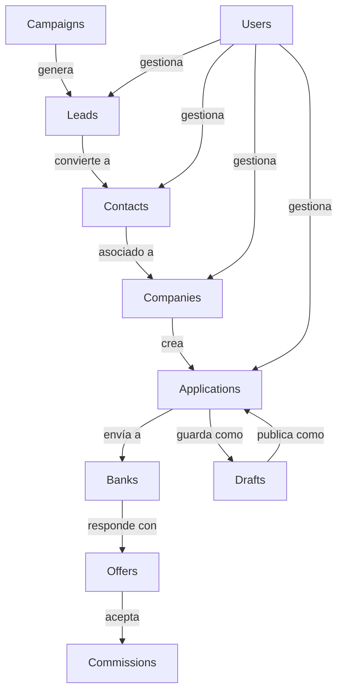

### 2.6 Estructura de Routing y Navegación

El routing está centralizado en `app.routes.ts` con:
- **Lazy Loading**: Cada feature se carga bajo demanda
- **Guards**: `AuthGuard` + `PermissionGuard` en cascada
- **Data Metadata**: Cada ruta incluye icono, nombre y permisos requeridos

**Flujo de Navegación:**
1. Usuario intenta acceder a una ruta
2. `AuthGuard` verifica autenticación (Auth0)
3. `PermissionGuard` carga permisos del token JWT
4. Valida permisos requeridos en `route.data.permissions`
5. Si no tiene permisos → redirige a `/applications`
6. Si tiene permisos → carga el módulo lazy

### 2.7 Guards, Interceptors y Middlewares

#### Guards
- **AuthGuard** (Auth0): Verifica que el usuario esté autenticado
- **PermissionGuard**: Valida permisos específicos antes de activar rutas
- **CanDeactivateWithoutNote**: Previene salida de componentes sin notas requeridas

#### Interceptors
- **authHttpInterceptorFn** (Auth0): Inyecta tokens JWT en requests HTTP
  - Aplica a: `${BASE_API}/*` y `https://${AUTH0_DOMAIN}/api/v2/*`

#### Middlewares
- **ErrorHandlerService**: Manejo centralizado de errores HTTP
- **UserActivityMonitorService**: Monitorea actividad del usuario (accesos denegados)

---

## 3. ANÁLISIS DE LÓGICA DE NEGOCIO POR MÓDULO

### 3.1 MÓDULO: APPLICATIONS (Aplicaciones)

#### a) Propósito y Funcionalidad

**Propósito de Negocio:**
El módulo de Applications es el **corazón del CRM**. Gestiona el ciclo de vida completo de las solicitudes de préstamo comercial desde su creación hasta su cierre.

**Problema que Resuelve:**
- Centraliza la gestión de solicitudes de préstamo
- Facilita el envío de aplicaciones a múltiples bancos
- Rastrea ofertas y respuestas de bancos
- Gestiona el estado y progreso de cada aplicación

**Usuarios Objetivo:**
- **Agentes/Brokers**: Crean y gestionan aplicaciones de sus clientes
- **Supervisores**: Supervisan todas las aplicaciones del equipo
- **Administradores**: Acceso completo al sistema

#### b) Flujo de Datos y Operaciones

**Crear Aplicación:**
1. Usuario selecciona una Company existente
2. Completa formulario: monto, producto, referral
3. Sube documentos: bank statements, MTD statements, credit card statements, filled applications
4. Opcionalmente sube additional statements (máx 5)
5. Sistema valida documentos y crea la aplicación

**Estados de Aplicación:**
```typescript
enum APPLICATION_STATUS {
  READY_TO_SEND = 'READY_TO_SEND',      // Lista para enviar a bancos
  SENT = 'SENT',                        // Enviada a bancos
  REJECTED = 'REJECTED',                // Rechazada
  OFFERED = 'OFFERED',                  // Tiene ofertas de bancos
  OFFER_ACCEPTED = 'OFFER_ACCEPTED',    // Oferta aceptada
  APPROVED_NOT_FUNDED = 'APPROVED_NOT_FUNDED', // Aprobada pero no financiada
  COMPLETED = 'COMPLETED'               // Completada/Financiada
}
```

**Operaciones CRUD:**
- **CREATE**: `createApplication(application, files)` - Crea con FormData (JSON + archivos)
- **READ**: `getApplication(id)` - Obtiene detalles completos
- **UPDATE**: `updateSubStatus(id, substatus)` - Actualiza subestado
- **DELETE**: `removeApplication(id)` - Elimina aplicación

**Validaciones de Negocio:**
- Monto: entre $1,000 y $20,000,000
- Máximo 5 additional statements
- Debe tener company asociada
- Documentos requeridos según tipo de producto

**Reglas de Negocio:**
1. Solo aplicaciones en `READY_TO_SEND` pueden enviarse a bancos
2. Las aplicaciones tienen un `position` (1-5) que determina prioridad
3. Se pueden transferir entre usuarios con permiso `TRANSFER_APPLICATION`
4. Las aplicaciones pueden completarse manualmente con `completeApplication()`

#### c) Estados y Transiciones

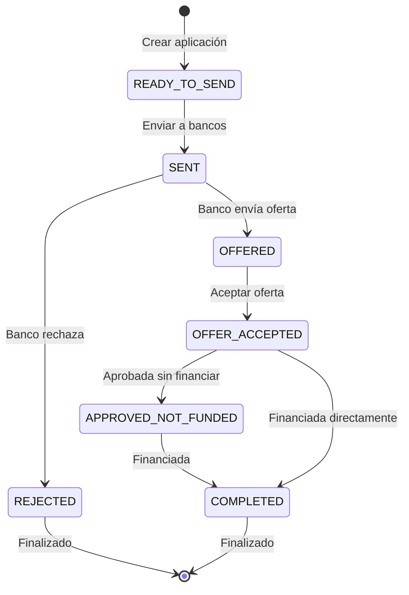

**Triggers de Cambio de Estado:**
- `sendAppToBanks()`: READY_TO_SEND → SENT
- Banco responde con oferta: SENT → OFFERED
- `acceptOffer()`: OFFERED → OFFER_ACCEPTED
- `rejectApplication()`: Cualquier estado → REJECTED
- `completeApplication()`: Cualquier estado → COMPLETED

#### d) Permisos y Seguridad

**Permisos Requeridos:**
- `CREATE_APPLICATION`: Crear nuevas aplicaciones
- `READ_APPLICATION` / `READ_OWN_APPLICATION`: Ver aplicaciones
- `LIST_APPLICATIONS` / `LIST_OWN_APPLICATIONS`: Listar aplicaciones
- `UPDATE_APPLICATION`: Actualizar aplicaciones
- `SEND_APPLICATION`: Enviar a bancos
- `TRANSFER_APPLICATION`: Transferir entre usuarios
- `DELETE_APPLICATION`: Eliminar aplicaciones
- `VIEW_OFFER_COMMISSION`: Ver comisiones de ofertas

**Control de Acceso:**
- Usuarios con `LIST_OWN_APPLICATIONS` solo ven sus aplicaciones
- Usuarios con `LIST_APPLICATIONS` ven todas
- El sistema diferencia entre "own" y "all" en cada operación

---

### 2.2 MÓDULO: LEADS (Prospectos)

#### a) Propósito y Funcionalidad

**Propósito de Negocio:**
Gestiona leads/prospectos que aún no son contactos formales. Permite importar leads masivamente desde archivos CSV/Excel y convertirlos en contactos y empresas.

**Problema que Resuelve:**
- Importación masiva de prospectos
- Seguimiento de leads antes de convertirlos en contactos
- Gestión de campañas de generación de leads
- Historial de llamadas y notas por prospecto

**Usuarios Objetivo:**
- **Agentes de Ventas**: Gestionan sus leads asignados
- **Supervisores**: Supervisan leads del equipo
- **Marketing**: Crea campañas que generan leads

#### b) Flujo de Datos y Operaciones

**Crear Lead Group:**
1. Usuario sube archivo CSV/Excel con datos de prospectos
2. Define nombre del grupo y usuario asignado
3. Sistema procesa archivo y crea múltiples prospects
4. Retorna filas que fueron omitidas (duplicados, errores)

**Estructura de Datos:**
- **LeadGroup**: Contiene múltiples prospects
  - `id`, `name`, `prospects` (count), `created_by`, `assigned_to`
- **Prospect**: Prospecto individual
  - `id`, `company`, `name`, `email`, `phone`, `last_call`, `note_count`, `follow_up_call`, `notes`, `call_history`

**Operaciones:**
- `createLead(leadGroup, file)`: Crea grupo desde archivo
- `searchLeads(search)`: Busca grupos de leads
- `searchProspects(leadGroupId, search)`: Lista prospects de un grupo
- `getProspect(leadId, prospectId)`: Obtiene detalles de prospecto
- `addProspectNote()`: Añade nota a prospecto
- `transferLead()`: Transfiere lead a otro usuario

**Reglas de Negocio:**
1. Los leads se asignan a usuarios específicos
2. Cada prospecto puede tener múltiples notas y llamadas
3. Los leads pueden transferirse entre usuarios
4. El sistema rastrea `follow_up_call` para recordatorios

#### c) Estados y Transiciones

Los leads no tienen estados formales, pero tienen:
- **Asignación**: Pueden transferirse entre usuarios
- **Seguimiento**: `follow_up_call` indica cuándo contactar nuevamente
- **Conversión**: Los prospects se convierten manualmente en Contacts/Companies

#### d) Permisos y Seguridad

- `CREATE_LEAD`: Crear grupos de leads
- `READ_LEAD`: Ver detalles de leads
- `LIST_LEADS` / `LIST_OWN_LEADS`: Listar leads
- `DELETE_LEAD`: Eliminar leads
- `TRANSFER_LEAD`: Transferir leads

---

### 2.3 MÓDULO: CONTACTS (Contactos)

#### a) Propósito y Funcionalidad

**Propósito de Negocio:**
Gestiona información de personas físicas (contactos personales) que pueden ser miembros de empresas o contactos independientes.

**Problema que Resuelve:**
- Centraliza información personal (SSN, identificación, documentos)
- Asocia contactos a empresas (como miembros)
- Gestiona documentos de identificación
- Permite notas y seguimiento por contacto

**Usuarios Objetivo:**
- **Agentes**: Gestionan contactos de sus clientes
- **Supervisores**: Supervisan todos los contactos

#### b) Flujo de Datos y Operaciones

**Crear Contacto:**
1. Usuario completa formulario: nombre, apellido, fecha nacimiento, SSN/ITIN
2. Añade dirección, teléfonos (máx 5), emails (máx 5)
3. Sube documentos de identificación (máx 6 archivos, 4 por tipo)
4. Sistema valida edad (21-99 años) y crea contacto

**Estructura de Datos:**
```typescript
interface Contact {
  id: string;
  first_name: string;
  last_name: string;
  birthdate: string;
  ssn: string;
  address: Address;
  phones: Phone[];
  emails: string[];
  documents: { id: string; url: string; type: string }[];
  notes: Note[];
  identification_type: 'ITIN' | 'SSN';
  created_by: User;
  created_at: string;
}
```

**Operaciones:**
- `createContact(contact, files)`: Crea con FormData
- `getContact(id)`: Obtiene detalles
- `updateContact(id, contact)`: Actualiza información
- `addFile(contactId, type, file)`: Añade documento
- `removeFile(contactId, fileId)`: Elimina documento
- `createNote(contactId, note)`: Añade nota
- `removeNote(contactId, noteId)`: Elimina nota
- `getContactCompanies(contactId)`: Obtiene empresas asociadas

**Validaciones:**
- Edad: 21-99 años
- Máximo 5 teléfonos
- Máximo 5 emails
- Máximo 6 documentos totales
- Máximo 4 documentos por tipo

**Reglas de Negocio:**
1. Los contactos pueden asociarse a múltiples empresas (como miembros)
2. Las notas tienen niveles: INFO, WARNING, CRITICAL
3. Se requiere nota antes de salir si no tiene permiso `READ_CONTACT_WITHOUT_NOTE`
4. Los contactos pueden transferirse entre usuarios

#### c) Estados y Transiciones

Los contactos no tienen estados formales, pero tienen:
- **Asociación a Empresas**: Pueden ser miembros de múltiples empresas
- **Notas**: Sistema de notas con niveles de importancia

#### d) Permisos y Seguridad

- `CREATE_CONTACT`: Crear contactos
- `READ_CONTACT` / `READ_OWN_CONTACT`: Ver contactos
- `LIST_CONTACTS` / `LIST_OWN_CONTACTS`: Listar contactos
- `UPDATE_CONTACT`: Actualizar contactos
- `DELETE_CONTACT`: Eliminar contactos
- `CREATE_CONTACT_NOTE`: Crear notas
- `READ_CONTACT_WITHOUT_NOTE`: Ver sin requerir nota
- `DELETE_CONTACT_NOTE`: Eliminar notas

---

### 2.4 MÓDULO: COMPANIES (Empresas)

#### a) Propósito y Funcionalidad

**Propósito de Negocio:**
Gestiona información de empresas que solicitan préstamos. Las empresas tienen miembros (contacts) y pueden tener múltiples aplicaciones.

**Problema que Resuelve:**
- Centraliza información empresarial (EIN, industria, tipo de entidad)
- Asocia miembros (contacts) a empresas
- Gestiona documentos empresariales
- Rastrea aplicaciones por empresa

**Usuarios Objetivo:**
- **Agentes**: Gestionan empresas de sus clientes
- **Supervisores**: Supervisan todas las empresas

#### b) Flujo de Datos y Operaciones

**Crear Empresa:**
1. Usuario completa: nombre, DBA, EIN, industria, tipo de entidad, fecha creación
2. Añade dirección, teléfonos, emails, servicio
3. Asocia miembros (contacts existentes, máx 10)
4. Sube documentos empresariales (EIN, W-9, Voided Check, etc.)
5. Sistema valida y crea empresa

**Estructura de Datos:**
```typescript
interface CompanyDetails {
  id: string;
  name: string;
  dba: string | null;
  tax_id: string;
  industry: Industry;
  creation_date: string;
  entity_type: string;
  phone_numbers: Phone[];
  service: string;
  emails: string[];
  address: Address;
  members: CompanyMember[];  // Contactos asociados
  notes: Note[];
  created_by: User;
  documents: { id: string; url: string; type: string }[];
  created_at: string;
}
```

**Operaciones:**
- `createCompany(company, typedFiles)`: Crea con FormData
- `getCompany(id)`: Obtiene detalles
- `updateCompany(id, company)`: Actualiza información
- `addFile(companyId, type, file)`: Añade documento
- `removeFile(companyId, fileId)`: Elimina documento
- `createNote(companyId, note)`: Añade nota
- `removeNote(companyId, noteId)`: Elimina nota
- `transferCompany(companyId, userId)`: Transfiere empresa

**Validaciones:**
- Máximo 10 miembros por empresa
- Máximo 4 documentos por tipo
- Tamaño máximo de archivo: 10MB

**Reglas de Negocio:**
1. Una empresa puede tener múltiples aplicaciones
2. Los miembros son contactos existentes asociados
3. Se puede obtener el último período válido de aplicación: `lastValidPeriod(companyId)`
4. Las empresas pueden transferirse entre usuarios

#### c) Estados y Transiciones

Las empresas no tienen estados formales, pero tienen:
- **Asociación con Aplicaciones**: Relación 1:N
- **Miembros**: Contactos asociados como miembros

#### d) Permisos y Seguridad

- `CREATE_COMPANY`: Crear empresas
- `READ_COMPANY` / `READ_OWN_COMPANY`: Ver empresas
- `LIST_COMPANIES` / `LIST_OWN_COMPANIES`: Listar empresas
- `UPDATE_COMPANY`: Actualizar empresas
- `DELETE_COMPANY`: Eliminar empresas
- `CREATE_COMPANY_NOTE`: Crear notas
- `READ_COMPANY_WITHOUT_NOTE`: Ver sin requerir nota
- `TRANSFER_COMPANY`: Transferir empresas

---

### 2.5 MÓDULO: BANKS (Bancos)

#### a) Propósito y Funcionalidad

**Propósito de Negocio:**
Gestiona instituciones financieras (bancos y brokers) que reciben aplicaciones y envían ofertas de préstamo.

**Problema que Resuelve:**
- Centraliza información de bancos/lenders
- Gestiona restricciones y criterios de cada banco
- Permite blacklist de bancos
- Facilita envío masivo de emails a bancos

**Usuarios Objetivo:**
- **Administradores**: Gestionan catálogo de bancos
- **Agentes**: Consultan bancos disponibles y sus ofertas

#### b) Flujo de Datos y Operaciones

**Crear Banco:**
1. Usuario completa: nombre, tipo (LENDER/BROKER), manager, dirección
2. Define contactos del banco
3. Configura constraints (restricciones por industria, territorio, etc.)
4. Sube documentos del banco
5. Sistema crea banco

**Estructura de Datos:**
```typescript
interface Bank {
  id: string;
  name: string;
  bank_type: 'lender' | 'broker';
  manager: string;
  status: string;
  address: Address;
  contacts: BankContact[];
  constraints: BankConstraint;  // Restricciones de negocio
  documents: { id: string; url: string }[];
  blacklist: {
    blacklisted_at: string;
    blacklisted_by: string;
    note: string;
  } | null;
}
```

**Operaciones:**
- `createBank(bank, files)`: Crea banco
- `getBank(id)`: Obtiene detalles
- `updateBank(id, bank)`: Actualiza información
- `addFile(bankId, file)`: Añade documento
- `removeFile(bankId, fileId)`: Elimina documento
- `getBankOffers(bankId, search)`: Obtiene ofertas del banco
- `blacklistBank(bankId, note)`: Añade a blacklist
- `removeFromBlacklist(bankId)`: Remueve de blacklist
- `sendEmailToBanks(request)`: Envía email masivo a bancos

**Reglas de Negocio:**
1. Los bancos pueden estar en blacklist (temporal o permanente)
2. Cada banco tiene constraints que determinan qué aplicaciones puede recibir
3. El sistema recomienda bancos para aplicaciones: `getRecommendedBanks(applicationId)`
4. Los bancos pueden tener múltiples ofertas activas

#### c) Estados y Transiciones

Los bancos tienen:
- **Status**: Estado general del banco
- **Blacklist**: Pueden estar blacklisted con nota explicativa

#### d) Permisos y Seguridad

- `CREATE_BANK`: Crear bancos
- `READ_BANK`: Ver bancos
- `LIST_BANKS`: Listar bancos
- `UPDATE_BANK`: Actualizar bancos
- `DELETE_BANK`: Eliminar bancos
- `SEND_EMAIL_BANK`: Enviar emails a bancos

**Nota**: No hay permisos "own" para bancos - todos los usuarios con permisos ven todos los bancos.

---

### 2.6 MÓDULO: COMMISSIONS (Comisiones)

#### a) Propósito y Funcionalidad

**Propósito de Negocio:**
Gestiona la distribución de comisiones cuando se acepta una oferta de préstamo. Calcula PSF (Processing Service Fee) y comisiones para múltiples usuarios.

**Problema que Resuelve:**
- Distribuye comisiones entre múltiples usuarios
- Calcula PSF y comisiones por oferta aceptada
- Permite edición de distribución antes de publicar
- Rastrea comisiones por aplicación/ofeta

**Usuarios Objetivo:**
- **Administradores**: Configuran distribución de comisiones
- **Contadores**: Revisan y aprueban comisiones

#### b) Flujo de Datos y Operaciones

**Estructura de Datos:**
```typescript
interface FormCommission {
  psf: {
    total: number;
    distribution: DistributionItem[];  // { amount, user_id }[]
  };
  commission: {
    distribution: DistributionItem[];
  };
}
```

**Operaciones:**
- `searchCommissions(search)`: Busca comisiones
- `getCommission(id)`: Obtiene detalles de comisión
- `saveCommission(id, commission)`: Guarda distribución (sin publicar)
- `publishCommission(id)`: Publica comisión (la hace final)

**Reglas de Negocio:**
1. Las comisiones se crean automáticamente cuando se acepta una oferta
2. Pueden editarse antes de publicar
3. Una vez publicadas, no pueden modificarse
4. La distribución puede incluir múltiples usuarios con montos específicos

#### c) Estados y Transiciones

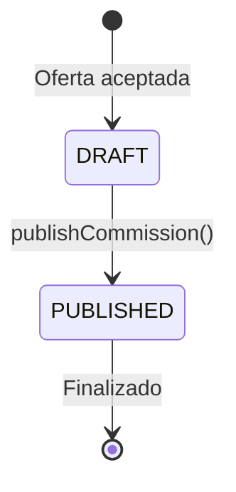

#### d) Permisos y Seguridad

- `LIST_COMMISSIONS`: Listar comisiones
- `VIEW_OFFER_COMMISSION`: Ver comisiones de ofertas

---

### 2.7 MÓDULO: CAMPAIGNS (Campañas)

#### a) Propósito y Funcionalidad

**Propósito de Negocio:**
Gestiona campañas de marketing que generan leads. Permite importar archivos de leads asociados a una campaña específica.

**Problema que Resuelve:**
- Asocia leads a campañas de marketing
- Permite iniciar/detener campañas
- Rastrea efectividad de campañas

**Usuarios Objetivo:**
- **Marketing**: Crea y gestiona campañas
- **Supervisores**: Supervisan campañas activas

#### b) Flujo de Datos y Operaciones

**Crear Campaña:**
1. Usuario define nombre y configuración de campaña
2. Sube archivo con leads
3. Sistema crea campaña y procesa leads

**Operaciones:**
- `getCampaigns()`: Lista todas las campañas
- `createCampaign(campaign, file)`: Crea campaña con archivo de leads
- `startCampaign(campaignId)`: Inicia campaña
- `stopCampaign(campaignId)`: Detiene campaña

**Reglas de Negocio:**
1. Las campañas pueden estar activas o detenidas
2. Los leads generados se asocian a la campaña
3. Las campañas pueden reactivarse

#### c) Estados y Transiciones

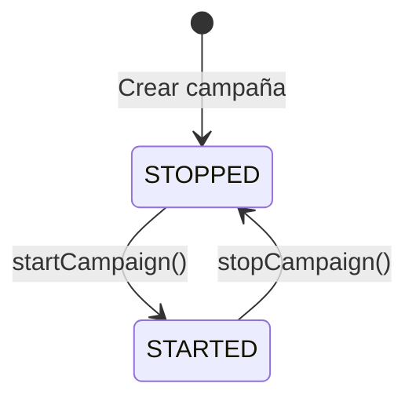

#### d) Permisos y Seguridad

- `LIST_CAMPAIGN`: Listar campañas
- `CREATE_CAMPAIGN`: Crear campañas

---

### 2.8 MÓDULO: DRAFTS (Borradores)

#### a) Propósito y Funcionalidad

**Propósito de Negocio:**
Permite guardar aplicaciones como borradores antes de enviarlas. Los borradores pueden editarse y publicarse cuando estén completos.

**Problema que Resuelve:**
- Permite trabajo incremental en aplicaciones
- Evita pérdida de trabajo en progreso
- Facilita revisión antes de enviar

**Usuarios Objetivo:**
- **Agentes**: Guardan trabajo en progreso
- **Supervisores**: Revisan borradores antes de publicar

#### b) Flujo de Datos y Operaciones

**Operaciones:**
- `searchDrafts(search)`: Busca borradores
- `getDraft(id)`: Obtiene detalles
- `updateDraft(draftId, updates)`: Actualiza borrador (array de cambios)
- `publishDraft(draftId)`: Publica borrador como aplicación
- `deleteDraft(draftId)`: Elimina borrador
- `transferDraft(draftId, userId)`: Transfiere borrador

**Reglas de Negocio:**
1. Los borradores pueden actualizarse parcialmente
2. Al publicar, se convierte en aplicación real
3. Los borradores pueden transferirse entre usuarios

#### c) Estados y Transiciones

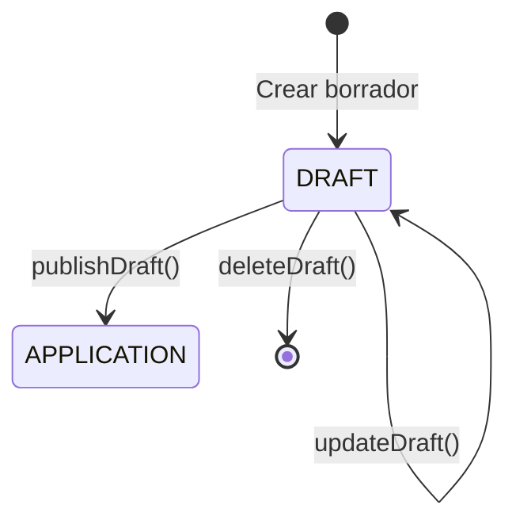

#### d) Permisos y Seguridad

- `CREATE_DRAFT_APPLICATION`: Crear borradores
- `READ_DRAFT_APPLICATION` / `READ_OWN_DRAFT_APPLICATION`: Ver borradores
- `LIST_DRAFT_APPLICATIONS` / `LIST_OWN_DRAFT_APPLICATIONS`: Listar borradores
- `UPDATE_DRAFT_APPLICATION`: Actualizar borradores
- `PUBLISH_DRAFT_APPLICATION`: Publicar borradores
- `DELETE_DRAFT_APPLICATION`: Eliminar borradores
- `TRANSFER_DRAFT`: Transferir borradores

---

### 2.9 MÓDULO: USERS (Usuarios)

#### a) Propósito y Funcionalidad

**Propósito de Negocio:**
Gestiona usuarios del sistema, sus roles y permisos. Permite habilitar/deshabilitar usuarios.

**Problema que Resuelve:**
- Control de acceso y permisos
- Gestión de roles y usuarios
- Habilitación/deshabilitación de cuentas

**Usuarios Objetivo:**
- **Administradores**: Gestionan usuarios y permisos

#### b) Flujo de Datos y Operaciones

**Operaciones:**
- `searchUser(search)`: Busca usuarios
- `createUser(user)`: Crea usuario
- `updateUser(userId, update)`: Actualiza usuario
- `getRoles()`: Obtiene roles disponibles
- `addRole(userId, roleId)`: Añade rol a usuario
- `removeRole(userId, roleId)`: Remueve rol de usuario
- `disableUser(userId)`: Deshabilita usuario
- `enableUser(userId)`: Habilita usuario
- `updateProfile(update)`: Actualiza perfil propio

**Reglas de Negocio:**
1. Los usuarios pueden tener múltiples roles
2. Los roles determinan permisos (vía Auth0)
3. Los usuarios pueden estar deshabilitados (no pueden iniciar sesión)

#### c) Estados y Transiciones

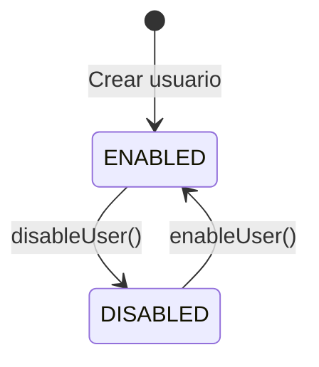

#### d) Permisos y Seguridad

- `LIST_USER`: Listar usuarios
- `CREATE_USER`: Crear usuarios
- `UPDATE_USER`: Actualizar usuarios

---

## 3. DIAGRAMAS DE FLUJO

### 3.1 Flujo de Usuario Principal: Login → Crear Aplicación → Enviar a Bancos

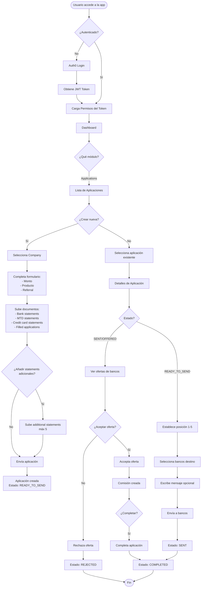

### 3.2 Flujo de Datos: Frontend → Backend

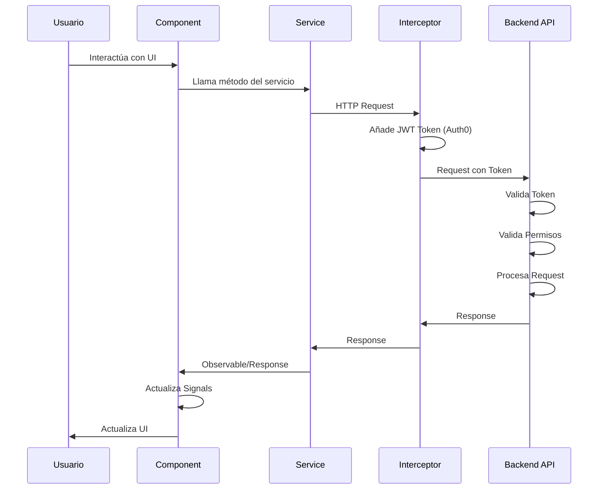

### 3.3 Flujo: Lead → Contact → Company → Application

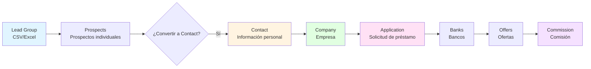

### 3.4 Flujo de Notificaciones de Bancos

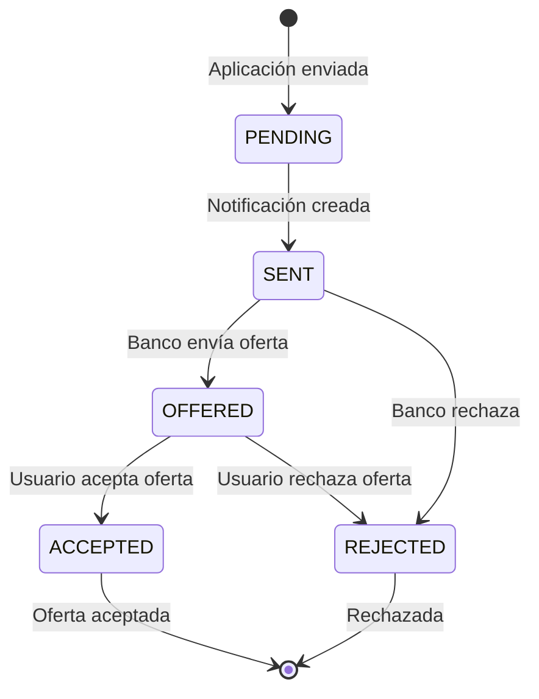

---

## 4. ANÁLISIS DE SERVICIOS Y API

### 4.1 Servicios Principales

| Servicio | Responsabilidad | Endpoints Principales |
|----------|----------------|----------------------|
| **ApplicationsService** | Gestión de aplicaciones | `/v1/applications` |
| **ContactService** | Gestión de contactos | `/v1/contacts` |
| **CompanyService** | Gestión de empresas | `/v1/companies` |
| **BankService** | Gestión de bancos | `/v1/banks` |
| **LeadsService** | Gestión de leads | `/v1/leads` |
| **CommissionsService** | Gestión de comisiones | `/v1/commissions` |
| **CampaignService** | Gestión de campañas | `/v1/campaigns` |
| **DraftsService** | Gestión de borradores | `/v1/drafts` |
| **UserService** | Gestión de usuarios | `/v1/users` |
| **VoIPService** | Llamadas telefónicas | `/v1/users/make-a-call` |
| **DashboardService** | Dashboard | `/v1/dashboard` |
| **MeService** | Usuario actual | `/v1/me` |

### 4.2 Mapeo de Endpoints API

#### Applications
- `GET /v1/applications` - Lista aplicaciones (con paginación y búsqueda)
- `GET /v1/applications/:id` - Obtiene detalles
- `POST /v1/applications` - Crea aplicación (FormData: body + documents)
- `PUT /v1/applications/:id/notifications` - Envía a bancos
- `GET /v1/applications/:id/notifications` - Obtiene notificaciones
- `PUT /v1/applications/:id/notifications/:notificationId/accept/:offerId` - Acepta oferta
- `PUT /v1/applications/:id/notifications/:notificationId/cancel/:offerId` - Cancela oferta
- `PUT /v1/applications/:id/notifications/:notificationId/update/:offerId` - Actualiza oferta
- `PUT /v1/applications/:id/notifications/:notificationId/restore` - Restaura notificación
- `PATCH /v1/applications/:id/reject` - Rechaza aplicación
- `PATCH /v1/applications/:id/notifications/:notificationId` - Rechaza notificación
- `PUT /v1/applications/:id/complete` - Completa aplicación
- `PUT /v1/applications/:id/substatus` - Actualiza subestado
- `PUT /v1/applications/:id/transfer-to/:userId` - Transfiere aplicación
- `PATCH /v1/applications/:id/position/:position` - Actualiza posición
- `DELETE /v1/applications/:id` - Elimina aplicación
- `GET /v1/applications/:id/recommended-banks` - Obtiene bancos recomendados
- `GET /v1/last-application-period/:companyId` - Último período válido

#### Contacts
- `GET /v1/contacts` - Lista contactos
- `GET /v1/contacts/:id` - Obtiene detalles
- `POST /v1/contacts` - Crea contacto (FormData)
- `PUT /v1/contacts/:id` - Actualiza contacto
- `PUT /v1/contacts/:id/documents/:type` - Añade documento
- `DELETE /v1/contacts/:id/documents/:fileId` - Elimina documento
- `POST /v1/contacts/:id/notes` - Crea nota
- `DELETE /v1/contacts/:id/notes/:noteId` - Elimina nota
- `GET /v1/companies/contact/:contactId` - Empresas del contacto

#### Companies
- `GET /v1/companies` - Lista empresas
- `GET /v1/companies/:id` - Obtiene detalles
- `POST /v1/companies` - Crea empresa (FormData)
- `PUT /v1/companies/:id` - Actualiza empresa
- `PUT /v1/companies/:id/documents/:type` - Añade documento
- `DELETE /v1/companies/:id/documents/:fileId` - Elimina documento
- `POST /v1/companies/:id/notes` - Crea nota
- `DELETE /v1/companies/:id/notes/:noteId` - Elimina nota
- `PUT /v1/companies/:id/transfer-to/:userId` - Transfiere empresa

#### Banks
- `GET /v1/banks` - Lista bancos
- `GET /v1/banks/:id` - Obtiene detalles
- `POST /v1/banks` - Crea banco (FormData)
- `PUT /v1/banks/:id` - Actualiza banco
- `PUT /v1/banks/:id/documents` - Añade documento
- `DELETE /v1/banks/:id/documents/:fileId` - Elimina documento
- `GET /v1/banks/:id/offers` - Obtiene ofertas del banco
- `PATCH /v1/banks/:id/blacklist` - Añade a blacklist
- `DELETE /v1/banks/:id/blacklist` - Remueve de blacklist
- `POST /v1/banks/send-email` - Envía email masivo

#### Leads
- `GET /v1/leads` - Lista grupos de leads
- `GET /v1/leads/:leadId` - Lista prospects del grupo
- `GET /v1/leads/:leadId/prospects/:prospectId` - Obtiene prospecto
- `POST /v1/leads` - Crea grupo de leads (FormData: file + body)
- `POST /v1/leads/:leadId/prospects/:prospectId/notes` - Añade nota
- `PUT /v1/leads/:leadId/transfer/:userId` - Transfiere lead

#### Commissions
- `GET /v1/commissions` - Lista comisiones
- `GET /v1/commissions/:id` - Obtiene detalles
- `PUT /v1/commissions/:id` - Guarda comisión (sin publicar)
- `PUT /v1/commissions/:id/publish` - Publica comisión

#### Campaigns
- `GET /v1/campaigns` - Lista campañas
- `POST /v1/campaigns` - Crea campaña (FormData)
- `PUT /v1/campaigns/:id/start` - Inicia campaña
- `PUT /v1/campaigns/:id/stop` - Detiene campaña

#### Drafts
- `GET /v1/drafts` - Lista borradores
- `GET /v1/drafts/:id` - Obtiene detalles
- `PUT /v1/drafts/:id` - Actualiza borrador
- `PUT /v1/drafts/:id/publish` - Publica borrador
- `DELETE /v1/drafts/:id` - Elimina borrador
- `PUT /v1/drafts/:id/transfer-to/:userId` - Transfiere borrador

#### Users
- `GET /v1/users` - Lista usuarios
- `GET /v1/users/roles` - Lista roles
- `POST /v1/users` - Crea usuario
- `PUT /v1/users` - Actualiza perfil propio
- `PUT /v1/users/:id` - Actualiza usuario
- `PUT /v1/users/roles/add` - Añade rol
- `PUT /v1/users/roles/remove` - Remueve rol
- `DELETE /v1/users/disable/:id` - Deshabilita usuario
- `PUT /v1/users/enable/:id` - Habilita usuario
- `POST /v1/users/make-a-call` - Realiza llamada
- `POST /v1/users/make-custom-a-call` - Llamada personalizada

### 4.3 Gestión de Estado

La aplicación utiliza **Angular Signals** para gestión de estado reactivo:

- **Component State**: Signals locales en componentes
- **Service State**: Signals en servicios (ej: `ApplicationDetailsService`)
- **Permissions State**: `UserPermissionsService` con signals computados
- **Notification State**: `NotificationService` con signals

**No hay estado global centralizado** (como NgRx) - cada feature gestiona su propio estado.

### 4.4 Manejo de Errores

- **ErrorHandlerService**: Manejo centralizado de errores HTTP
- **HttpService**: Wrapper del HttpClient con manejo de errores
- **Error Handling en Components**: `catchError` en observables
- **404 Handling**: Redirección a rutas por defecto cuando no se encuentra recurso

---

## 5. ANÁLISIS DE COMPONENTES REUTILIZABLES

### 5.1 Componentes Compartidos

#### Inputs Personalizados (`components/inputs/`)
36 archivos de inputs reutilizables:
- `CustomInputComponent`: Input de texto genérico
- `CustomSelectComponent`: Select dropdown
- `CustomTextareaComponent`: Textarea
- `CustomDatePickerComponent`: Selector de fecha
- `CustomPhoneInputComponent`: Input de teléfono con validación
- `CustomEmailInputComponent`: Input de email
- `CustomFilePickerComponent`: Selector de archivos
- Y más...

**Propósito**: Estandarizar inputs en toda la aplicación con validación y estilos consistentes.

#### Modal (`components/modal/`)
- `ModalComponent`: Modal reutilizable con backdrop y cierre

#### Pagination (`components/pagination/`)
- `PaginationComponent`: Paginación estándar para listas

#### Note (`components/note/`)
- `NoteComponent`: Componente para crear/ver notas con niveles (INFO, WARNING, CRITICAL)

#### Phone Components
- `CallablePhoneComponent`: Muestra teléfono clickeable para llamar
- `CustomPhoneCallerComponent`: Componente para realizar llamadas
- `PhoneCallModalComponent`: Modal para realizar llamadas

#### Notification (`components/notification/`)
- `NotificationComponent`: Contenedor de notificaciones toast
- `ToastComponent`: Notificación individual con auto-dismiss

#### User Notifications (`components/user-notifications/`)
- `UserNotificationsComponent`: Integración con NotificationAPI para notificaciones en tiempo real

### 5.2 Pipes Personalizados

| Pipe | Propósito |
|------|-----------|
| `AddressPipe` | Formatea direcciones |
| `CustomDatePipe` | Formatea fechas |
| `DecodeUriPipe` | Decodifica URIs |
| `FormatPhonePipe` | Formatea números de teléfono |
| `MinNumberPipe` | Muestra número mínimo |
| `SafePipe` | Sanitiza HTML/URLs |
| `TextInitialsPipe` | Extrae iniciales de texto |
| `YearsAgoPipe` | Calcula años desde fecha |

### 5.3 Validators Personalizados

Validadores reutilizables en `utils/validators/`:
- Validación de archivos
- Validación de documentos de aplicación
- Validación de teléfonos
- Validación de emails
- Validación de montos
- Y más...

### 5.4 Utilities

#### Funciones (`utils/function/`)
- `hasPermission()`: Verifica permisos
- `fileNameFromURL()`: Extrae nombre de archivo de URL
- `fileTypeFromURL()`: Determina tipo de archivo
- `getPreviousPeriods()`: Calcula períodos anteriores
- Y más...

#### Servicios Utilitarios (`utils/services/`)
- `HttpService`: Wrapper del HttpClient
- `BusinessConfigService`: Configuración de negocio (límites, tipos, etc.)
- `UserPermissionsService`: Gestión de permisos
- `NotificationService`: Notificaciones toast
- `ErrorHandlerService`: Manejo de errores
- `UserActivityMonitorService`: Monitoreo de actividad

---

## 6. INTEGRACIONES EXTERNAS

### Diagrama de Integraciones Externas

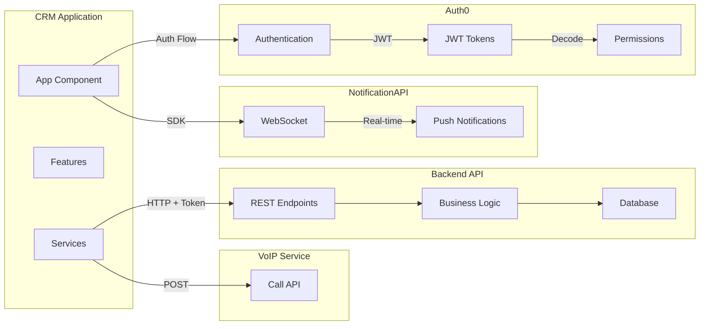

### 6.1 Auth0 - Autenticación y Autorización

**Propósito**: Autenticación de usuarios y gestión de permisos vía JWT.

**Configuración**:
- Domain, Client ID, Audience, Connection configurados en environment
- Interceptor HTTP inyecta tokens automáticamente
- `AuthGuard` protege rutas

**Flujo de Autenticación**:
1. Usuario intenta acceder → redirige a Auth0 si no autenticado
2. Auth0 autentica usuario
3. Redirige de vuelta con código
4. App intercambia código por tokens
5. Tokens JWT contienen permisos en claim `permissions`
6. `UserPermissionsService` decodifica y almacena permisos

**Permisos**: Los permisos vienen en el JWT token, no se consultan del backend en cada request.

### 6.2 NotificationAPI - Notificaciones en Tiempo Real

**Propósito**: Notificaciones push en tiempo real para usuarios.

**Integración**:
- SDK: `notificationapi-js-client-sdk`
- Se inicializa con `userId` y `clientId`
- WebSocket para notificaciones en tiempo real
- Sonido de notificación cuando hay nuevas notificaciones
- Popup en bottom-left de la pantalla

**Uso**: Notificaciones sobre cambios en aplicaciones, ofertas, etc.

### 6.3 Sentry - Monitoreo de Errores

**Propósito**: Tracking de errores en producción.

**Estado**: Configurado pero comentado en `app.config.ts` (líneas 11-21).

**Configuración**:
- Source maps upload en build process
- Error handler configurado (comentado)

### 6.4 VoIP - Sistema de Llamadas

**Propósito**: Realizar llamadas telefónicas desde la aplicación.

**Integración**:
- `VoIPService` hace requests a `/v1/users/make-a-call`
- `VoIPService` tiene `callRequested` EventEmitter
- Componentes de teléfono permiten hacer llamadas con un click

**Flujo**:
1. Usuario hace click en teléfono
2. `VoIPService.requestACall()` emite evento
3. Modal de llamada se abre
4. Usuario confirma → `VoIPService.makeACall()` → Backend inicia llamada

---

## 7. CASOS DE USO DE NEGOCIO

### 7.1 Caso de Uso: Crear y Gestionar una Aplicación

**Actor**: Agente/Broker

**Flujo Completo**:
1. **Crear Aplicación**:
   - Navega a Applications → Create Application
   - Selecciona Company existente (o crea nueva)
   - Completa: monto ($1K - $20M), producto, referral source
   - Sube documentos requeridos (bank statements, MTD, credit card, filled apps)
   - Opcionalmente sube hasta 5 additional statements
   - Envía → Aplicación creada en estado `READY_TO_SEND`

2. **Enviar a Bancos**:
   - Abre detalles de aplicación
   - Establece posición (1-5) para prioridad
   - Selecciona bancos destino (puede ver recomendados)
   - Escribe mensaje opcional
   - Envía → Estado cambia a `SENT`
   - Se crean `BankNotification` para cada banco

3. **Recibir y Gestionar Ofertas**:
   - Bancos responden con ofertas
   - Estado de notificación cambia a `OFFERED`
   - Usuario ve ofertas con detalles (monto, factor rate, puntos, comisión)
   - Puede aceptar, rechazar o actualizar oferta
   - Al aceptar → Estado `OFFER_ACCEPTED`, se crea comisión

4. **Completar Aplicación**:
   - Una vez financiada, marca como `COMPLETED`
   - La comisión puede editarse y publicarse

### 7.2 Caso de Uso: Leads → Contacts → Companies → Applications

**Flujo de Conversión**:

1. **Importar Leads**:
   - Marketing crea campaña
   - Sube archivo CSV/Excel con prospectos
   - Sistema crea `LeadGroup` con múltiples `Prospects`

2. **Gestionar Prospects**:
   - Agente ve prospects asignados
   - Realiza llamadas (registradas en `call_history`)
   - Añade notas sobre interacciones
   - Programa `follow_up_call`

3. **Convertir a Contact**:
   - Cuando prospect está calificado, agente crea `Contact`
   - Completa información personal (SSN, identificación, documentos)
   - Contact queda asociado al prospect (historial preservado)

4. **Crear o Asociar Company**:
   - Si el contact tiene empresa, crea `Company`
   - Asocia el `Contact` como miembro de la `Company`
   - Puede añadir más miembros (máx 10)

5. **Crear Application**:
   - Desde la Company, crea `Application`
   - Sigue flujo del Caso de Uso 7.1

**Relación de Negocio**: 
- Un Lead puede convertirse en múltiples Contacts (si hay múltiples personas)
- Un Contact puede ser miembro de múltiples Companies
- Una Company puede tener múltiples Applications
- Las Applications se envían a múltiples Banks
- Cada Bank puede enviar múltiples Offers

### 7.3 Caso de Uso: Sistema de Comisiones

**Actor**: Administrador/Contador

**Flujo**:
1. **Oferta Aceptada**:
   - Cuando se acepta una oferta, se crea automáticamente una `Commission` en estado DRAFT

2. **Configurar Distribución**:
   - Administrador abre comisión
   - Define PSF (Processing Service Fee) total y distribución
   - Define distribución de comisión entre usuarios
   - Cada distribución tiene `amount` y `user_id`

3. **Publicar Comisión**:
   - Revisa distribución
   - Publica comisión → Estado PUBLISHED (no editable)

**Reglas de Negocio**:
- PSF y comisión se distribuyen independientemente
- Múltiples usuarios pueden recibir porciones de la comisión
- Una vez publicada, no puede modificarse

### 7.4 Caso de Uso: Gestión de Campañas

**Actor**: Marketing

**Flujo**:
1. **Crear Campaña**:
   - Define nombre y configuración
   - Sube archivo con leads
   - Sistema crea campaña y procesa leads

2. **Gestionar Campaña**:
   - Puede iniciar/detener campaña
   - Los leads generados se asocian a la campaña
   - Puede ver efectividad (leads generados, conversiones)

3. **Seguimiento**:
   - Los agents trabajan los leads de la campaña
   - Se rastrea qué leads vienen de qué campaña

### 7.5 Caso de Uso: Sistema de Llamadas Telefónicas

**Actor**: Agente

**Flujo**:
1. **Iniciar Llamada**:
   - Ve teléfono en contacto/prospect/company
   - Hace click → se abre modal de llamada
   - Confirma → `VoIPService` hace request al backend
   - Backend inicia llamada vía sistema VoIP externo

2. **Registro**:
   - Las llamadas se registran en `call_history` del prospect/contact
   - Se puede programar `follow_up_call`

**Integración**: El backend se comunica con sistema VoIP externo (no visible en frontend).

---

## 8. DIAGRAMA DE ENTIDADES Y RELACIONES

### 8.1 Modelo de Datos

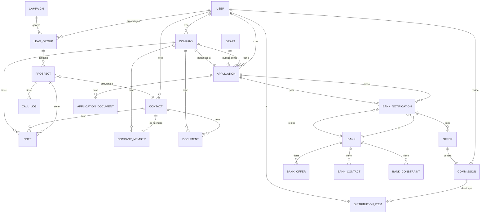

### 8.2 Relaciones de Negocio Detalladas

#### User (Usuario)
- **1:N** con LeadGroup (crea/asigna)
- **1:N** con Contact (crea)
- **1:N** con Company (crea)
- **1:N** con Application (crea/gestiona)
- **N:M** con Commission (recibe distribución)

#### LeadGroup → Prospect
- **1:N**: Un grupo contiene múltiples prospects
- Los prospects se convierten en Contacts

#### Contact → Company
- **N:M**: Un contact puede ser miembro de múltiples companies
- **1:N**: Un contact puede tener múltiples notes y documents

#### Company → Application
- **1:N**: Una company puede tener múltiples applications
- Las applications tienen estado y posición

#### Application → BankNotification → Offer
- **1:N**: Una application se envía a múltiples banks (notifications)
- **1:N**: Cada notification puede tener múltiples offers
- **1:1**: Una offer aceptada genera una commission

#### Commission → DistributionItem → User
- **1:N**: Una commission se distribuye entre múltiples users
- Cada distribución tiene un monto específico

#### Campaign → LeadGroup
- **1:N**: Una campaign genera múltiples lead groups

---

## 9. ANÁLISIS DE ESTADOS Y WORKFLOWS

### 9.1 Workflow Principal: Aplicación de Préstamo

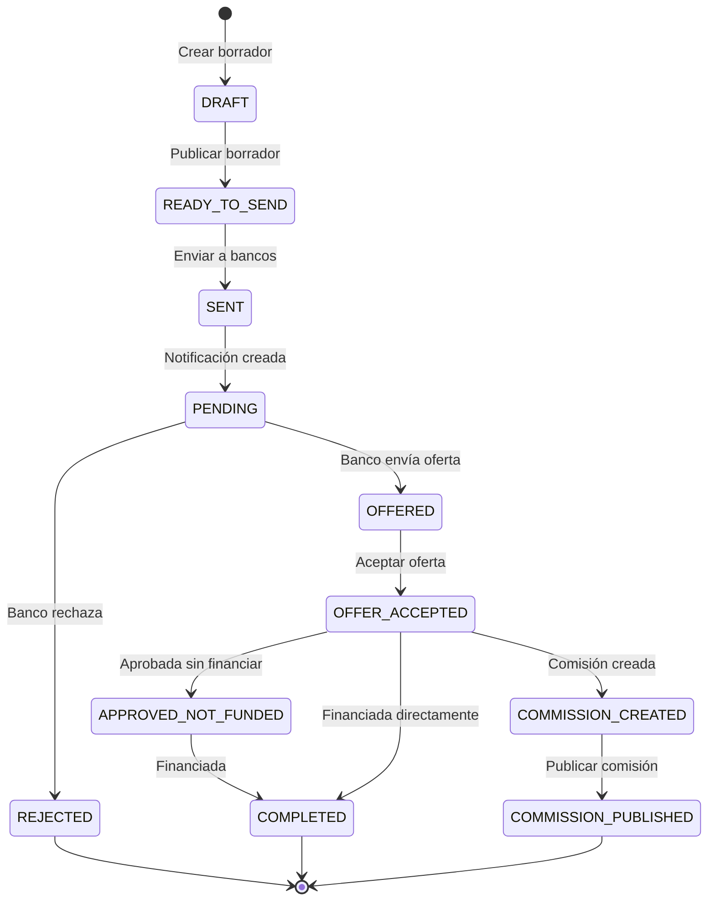

### 9.2 Workflow de Notificación de Banco

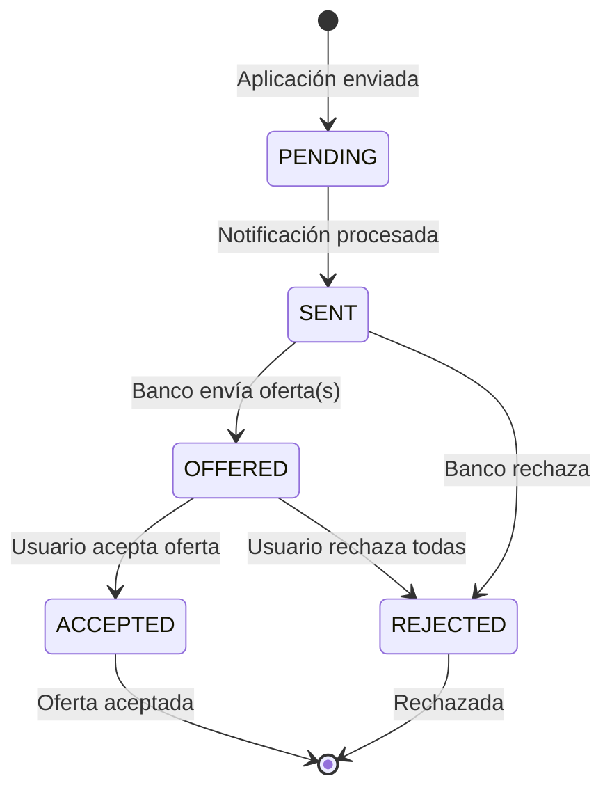

### 9.3 Workflow de Comisión

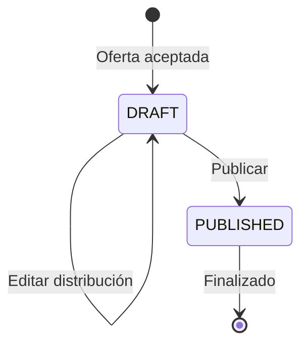

### 9.4 Workflow de Campaña

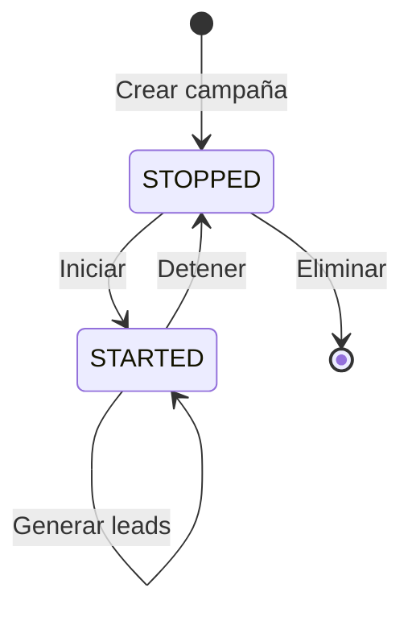

### 9.5 Automatizaciones

**Automáticas**:
1. **Creación de Commission**: Cuando se acepta una oferta, se crea automáticamente una commission en estado DRAFT
2. **Cambio de Estado OFFERED**: Cuando un banco envía una oferta, el estado de la notificación cambia automáticamente a OFFERED
3. **Carga de Permisos**: Al iniciar sesión, los permisos se cargan automáticamente del JWT token

**Manuales**:
1. Envío de aplicaciones a bancos
2. Aceptación/rechazo de ofertas
3. Publicación de comisiones
4. Completado de aplicaciones
5. Transferencia de entidades entre usuarios

---

## 10. RESUMEN EJECUTIVO

### 10.1 ¿Qué Hace la Aplicación?

**CRM Web Application** es un sistema de gestión de relaciones con clientes (CRM) especializado en el **sector de préstamos comerciales**. Facilita el proceso completo desde la generación de leads hasta el cierre de préstamos, incluyendo:

- **Gestión de Prospectos y Leads**: Importación masiva y seguimiento de prospectos
- **Gestión de Contactos y Empresas**: Información de personas y empresas que solicitan préstamos
- **Gestión de Aplicaciones**: Solicitudes de préstamo con documentos y estados
- **Gestión de Bancos**: Catálogo de instituciones financieras y sus ofertas
- **Gestión de Comisiones**: Distribución de comisiones entre agentes
- **Sistema de Llamadas**: Integración VoIP para llamadas desde la app
- **Campañas de Marketing**: Gestión de campañas que generan leads

### 10.2 Principales Flujos de Negocio

1. **Flujo de Lead a Préstamo**:
   - Lead → Prospect → Contact → Company → Application → Banks → Offers → Commission

2. **Flujo de Aplicación**:
   - Crear → Enviar a Bancos → Recibir Ofertas → Aceptar → Comisión → Completar

3. **Flujo de Comisión**:
   - Oferta Aceptada → Comisión Creada → Configurar Distribución → Publicar

### 10.3 Arquitectura en Términos de Negocio

**Capas de Negocio**:

1. **Capa de Adquisición**:
   - Campaigns generan Leads
   - Leads se convierten en Contacts/Companies

2. **Capa de Gestión**:
   - Contacts y Companies se gestionan con documentos y notas
   - Applications se crean desde Companies

3. **Capa de Procesamiento**:
   - Applications se envían a múltiples Banks
   - Banks responden con Offers
   - Offers se aceptan/rechazan

4. **Capa de Cierre**:
   - Offers aceptadas generan Commissions
   - Commissions se distribuyen entre usuarios
   - Applications se completan

**Separación de Responsabilidades**:
- **Agentes**: Gestionan sus propios leads, contacts, companies y applications
- **Supervisores**: Supervisan todo el equipo
- **Administradores**: Gestionan bancos, usuarios, permisos
- **Marketing**: Crea campañas y genera leads

### 10.4 Mapa Mental del Sistema

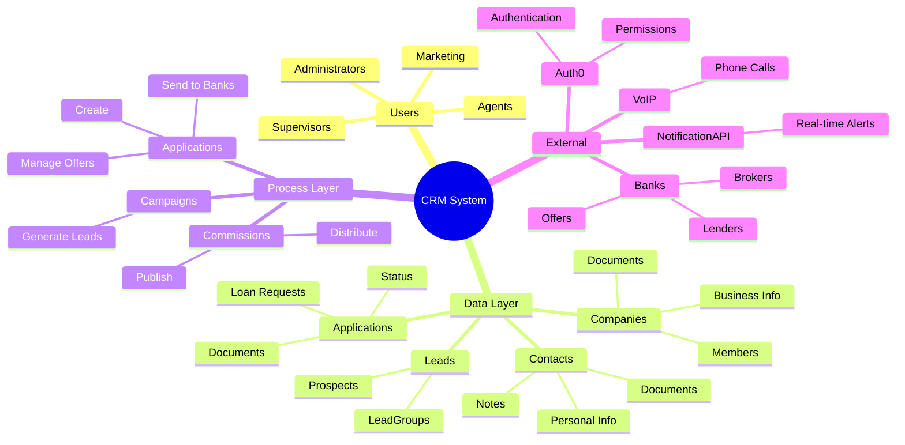

### 10.5 Puntos Clave del Sistema

**Fortalezas**:
- ✅ Arquitectura modular y escalable
- ✅ Sistema de permisos granular (own vs all)
- ✅ Gestión completa del ciclo de vida de préstamos
- ✅ Integración con sistemas externos (Auth0, VoIP, NotificationAPI)
- ✅ Sistema de notas y seguimiento robusto
- ✅ Gestión de documentos y archivos

**Características Destacadas**:
- **Multi-tenancy**: Sistema de permisos "own" permite que cada usuario vea solo sus datos o todos según permisos
- **Workflow Completo**: Desde lead hasta comisión, todo el proceso está cubierto
- **Flexibilidad**: Borradores, transferencias, múltiples ofertas por aplicación
- **Trazabilidad**: Notas, historial de llamadas, estados y transiciones rastreables

**Áreas de Mejora Potencial**:
- ⚠️ Sentry está comentado (monitoreo de errores no activo)
- ⚠️ No hay estado global centralizado (podría beneficiarse de NgRx para features complejas)
- ⚠️ Algunas validaciones de negocio podrían estar en el backend (no solo frontend)

---

## 11. ANÁLISIS PROFUNDO: MÓDULO APPLICATIONS

### 11.1 Contexto de Negocio

#### ¿Qué Problema de Negocio Resuelve?

El módulo **Applications** es el **corazón del CRM** y resuelve los siguientes problemas críticos del negocio de préstamos comerciales:

1. **Centralización de Solicitudes de Préstamo**:
   - Antes: Las solicitudes estaban dispersas en emails, hojas de cálculo y documentos físicos
   - Ahora: Todas las solicitudes están centralizadas en un solo sistema con trazabilidad completa

2. **Gestión del Ciclo de Vida Completo**:
   - Desde la creación hasta el cierre, cada aplicación pasa por múltiples estados
   - El sistema rastrea cada transición, quién la hizo y cuándo

3. **Coordinación con Múltiples Bancos**:
   - Una aplicación puede enviarse a múltiples bancos simultáneamente
   - El sistema gestiona las respuestas (ofertas/rechazos) de cada banco
   - Permite comparar ofertas y tomar decisiones informadas

4. **Gestión de Documentos Compleja**:
   - Cada aplicación requiere múltiples tipos de documentos (bank statements, MTD, credit card, filled apps)
   - El sistema valida, organiza y presenta estos documentos de forma estructurada

5. **Trazabilidad y Auditoría**:
   - Historial completo de cambios de estado
   - Notas y comentarios en cada etapa
   - Registro de quién hizo qué y cuándo

#### ¿Quiénes lo Usan y en Qué Situaciones?

**1. Agentes/Brokers (Usuarios Principales)**:
- **Situación**: Tienen clientes (companies) que necesitan préstamos
- **Uso**:
  - Crean aplicaciones desde companies existentes
  - Suben documentos requeridos
  - Envían aplicaciones a múltiples bancos
  - Gestionan ofertas recibidas
  - Aceptan/rechazan ofertas
  - Completan aplicaciones cuando se financian

**2. Supervisores**:
- **Situación**: Supervisan el trabajo de su equipo
- **Uso**:
  - Ven todas las aplicaciones del equipo (con permiso `LIST_APPLICATIONS`)
  - Monitorean el progreso de aplicaciones
  - Revisan ofertas y ayudan en decisiones
  - Transfieren aplicaciones entre agentes si es necesario

**3. Administradores**:
- **Situación**: Gestión administrativa del sistema
- **Uso**:
  - Acceso completo a todas las aplicaciones
  - Pueden eliminar aplicaciones en estado `READY_TO_SEND`
  - Gestionan transferencias entre usuarios
  - Revisan estadísticas y reportes

**4. Bancos (Indirectamente)**:
- **Situación**: Reciben aplicaciones y responden con ofertas
- **Uso**: A través de integraciones backend, reciben notificaciones y envían ofertas

### 11.2 Análisis Técnico

#### Estructura de Archivos y Componentes

```
features/
├── applications/                    # Lista de aplicaciones
│   ├── applications.component.ts     # Componente principal de lista
│   ├── applications.component.html   # Template de lista
│   ├── routes.ts                     # Rutas del módulo
│   └── components/
│       ├── application-not-found/    # Componente cuando no hay resultados
│       ├── delete-application/       # Modal para eliminar aplicación
│       ├── transfer-application/      # Modal para transferir aplicación
│       └── document-picker/          # Selector de documentos
│
├── applications-details/             # Detalles de una aplicación
│   ├── applications-details.component.ts
│   ├── applications-details.component.html
│   ├── applications-details.service.ts  # Servicio de estado local
│   └── components/
│       ├── send-to-banks/            # Enviar aplicación a bancos
│       ├── bank-notifications/       # Notificaciones de bancos
│       ├── offers/                   # Gestión de ofertas
│       ├── bank-history/             # Historial de bancos
│       ├── application-notes/       # Notas de la aplicación
│       ├── complete-application/     # Completar aplicación
│       ├── reject-application/      # Rechazar aplicación
│       ├── position-selector/       # Seleccionar posición (1-5)
│       ├── update-status/           # Actualizar subestado
│       ├── lead-time/               # Tiempo de procesamiento
│       ├── create-offer/            # Crear oferta manualmente
│       ├── update-offer/            # Actualizar oferta
│       ├── restore-offer/           # Restaurar oferta cancelada
│       └── reject-notification/     # Rechazar notificación de banco
│
└── create-application/               # Crear nueva aplicación
    ├── create-application.component.ts
    ├── create-application.component.html
    ├── create-application.service.ts  # Servicio de formulario multi-paso
    └── components/
        ├── application-details/      # Paso 1: Detalles básicos
        ├── upload-application-documents/  # Paso 2: Documentos
        ├── additional-statements/    # Paso 3: Statements adicionales
        └── application-created/     # Confirmación de creación
```

#### Servicios Relacionados y Responsabilidades

**1. ApplicationsService** (`services/applications.service.ts`):
- **Responsabilidad**: Comunicación con API backend para operaciones CRUD
- **Métodos Principales**:
  - `createApplication(application, files)`: Crea aplicación con FormData
  - `getApplication(id, errorHandled)`: Obtiene detalles completos
  - `searchApplication(search)`: Busca aplicaciones con filtros
  - `sendAppToBanks(appId, request)`: Envía aplicación a múltiples bancos
  - `getNotifications(id)`: Obtiene notificaciones de bancos
  - `acceptOffer(applicationId, notificationId, offerId)`: Acepta una oferta
  - `cancelOffer(...)`: Cancela una oferta aceptada
  - `updateOffer(...)`: Actualiza una oferta
  - `rejectApplication(applicationId, request)`: Rechaza aplicación
  - `rejectNotifications(...)`: Rechaza notificación de banco
  - `completeApplication(id)`: Marca aplicación como completada
  - `updateSubStatus(applicationId, request)`: Actualiza subestado
  - `updatePosition(applicationId, position)`: Actualiza posición (1-5)
  - `removeApplication(applicationId)`: Elimina aplicación
  - `transferApp(appId, userId)`: Transfiere aplicación a otro usuario
  - `getRecommendedBanks(id)`: Obtiene bancos recomendados
  - `lastValidPeriod(companyId)`: Último período válido de aplicación previa

**2. ApplicationDetailsService** (`features/applications-details/applications-details.service.ts`):
- **Responsabilidad**: Gestión de estado local de la aplicación actual
- **Signals**:
  - `application`: Signal con detalles de la aplicación
  - `notifications`: Signal con notificaciones de bancos
  - `totalOffers`: Computed signal con total de ofertas
  - `isBlocked`: Computed signal - true si está COMPLETED o REJECTED
  - `canItBeRejected`: Computed signal - true si puede ser rechazada

**3. CreateApplicationService** (`features/create-application/create-application.service.ts`):
- **Responsabilidad**: Gestión del formulario multi-paso para crear aplicación
- **Signals**:
  - `currentStep`: Paso actual (0-2)
  - `submitting`: Estado de envío
  - `created`: Si fue creada exitosamente
  - `files`: Archivos seleccionados
- **Formulario Reactivo**:
  - `step_1`: Detalles básicos (monto, producto, referral, company)
  - `step_2`: Bank statements (array dinámico según períodos)
  - `step_3`: MTD, credit card, additional statements
- **Lógica Especial**:
  - Calcula períodos requeridos basado en última aplicación de la company
  - Valida que no haya archivos duplicados
  - Mapea formulario a formato de API

**4. BankService** (`services/bank.service.ts`):
- **Responsabilidad**: Gestión de bancos (usado en send-to-banks)
- **Métodos Usados**:
  - `searchBanks(search)`: Busca bancos para selección
  - `getBank(id, errorHandled)`: Obtiene detalles de banco

**5. UserService** (`services/user.service.ts`):
- **Responsabilidad**: Gestión de usuarios (usado en transfer)
- **Métodos Usados**:
  - `searchUser(search)`: Busca usuarios para transferir aplicación

#### Interfaces y Modelos de Datos

**1. Application** (`interfaces/application/application.interface.ts`):
```typescript
interface Application {
  id: string;
  company_id: CompanyListItem;
  loan_amount: number;
  product: string;
  referral: Referral;
  filled_applications: null;
  bank_statements: DraftDocument[];
  mtd_statements: DraftDocument[];
  credit_card_statements: DraftDocument[];
  additional_statements: DraftDocument[];
}
```

**2. ApplicationDetails** (`interfaces/application/application-details.interface.ts`):
```typescript
enum APPLICATION_STATUS {
  READY_TO_SEND = 'READY_TO_SEND',
  SENT = 'SENT',
  REJECTED = 'REJECTED',
  OFFERED = 'OFFERED',
  OFFER_ACCEPTED = 'OFFER_ACCEPTED',
  APPROVED_NOT_FUNDED = 'APPROVED_NOT_FUNDED',
  COMPLETED = 'COMPLETED',
}

interface ApplicationDetails {
  id: string;
  product: string;
  loan_amount: number;
  status: APPLICATION_STATUS;
  position: number | null;  // 1-5, determina prioridad
  company: CompanyDetails & { documents: ApplicationDocument[] };
  additional_statements: ApplicationDocument[];
  bank_statements: ApplicationDocument[];
  credit_card_statements: ApplicationDocument[];
  filled_applications: ApplicationDocument[];
  mtd_statements: ApplicationDocument[];
  reject_reason: string;
  reject_reason_description?: string | null;
  substatus?: string | null;
}
```

**3. ApplicationListItem** (`interfaces/application/application-list-item.interface.ts`):
```typescript
interface ApplicationListItem {
  id: string;
  loan_amount: number;
  status: string;
  product: string;
  period: string;
  position: number | null;
  company: ApplicationListCompany;
  created_at: Date;
  created_by?: Partial<User>;
}
```

**4. BankNotification** (`interfaces/application/bank-notification.interface.ts`):
```typescript
enum BankNotificationStatus {
  OFFERED = 'OFFERED',
  PENDING = 'PENDING',
  REJECTED = 'REJECTED',
  ACCEPTED = 'ACCEPTED',
  SENT = 'SENT',
}

interface BankNotification {
  id: string;
  bank: Partial<Bank>;
  status: BankNotificationStatus;
  offers: Offer[];
  reject_reason: string;
  created_at: string;
  updated_at?: string;
  reject_reason_description: string | null;
}
```

**5. Offer** (`interfaces/application/offer.interface.ts`):
```typescript
interface Offer {
  id: string;
  purchased_amount: number;
  factor_rate: number;
  points: number;
  purchased_price: number;
  commission: number;
  position?: number;
  payment_plan_duration: number;
  payment_plan: string;
  status: string;  // 'ACCEPTED', 'ON_HOLD', etc.
  created_at: string;
  updated_at?: string;
}
```

**6. ApplicationDocument** (`interfaces/application/file-documents.interface.ts`):
```typescript
interface ApplicationDocument {
  period?: string;
  url: string;
  name?: string;
  source: string;
  amount?: number;
  negative_days?: number;
  transactions?: number;
  type?: string;  // 'pdf', 'image', etc.
  docType?: string;  // Tipo de documento
}
```

### 11.3 Flujo Completo

#### Diagrama de Flujo: Crear Aplicación

```mermaid
flowchart TD
    Start([Usuario accede a Create Application]) --> Step1[Paso 1: Application Details]
    
    Step1 --> SelectCompany{Selecciona Company}
    SelectCompany -->|Company seleccionada| CalculatePeriods[Calcula períodos requeridos<br/>basado en última aplicación]
    CalculatePeriods --> FillDetails[Completa:<br/>- Monto $1K-$20M<br/>- Producto<br/>- Referral opcional]
    FillDetails --> ValidateStep1{¿Válido?}
    ValidateStep1 -->|No| ShowErrors[Muestra errores]
    ShowErrors --> FillDetails
    ValidateStep1 -->|Sí| Next1[Siguiente paso]
    
    Next1 --> Step2[Paso 2: Upload Documents]
    Step2 --> UploadBankStatements[Sube Bank Statements<br/>4 períodos requeridos]
    UploadBankStatements --> ValidateStep2{¿Todos los<br/>statements válidos?}
    ValidateStep2 -->|No| ShowErrors2[Muestra errores]
    ShowErrors2 --> UploadBankStatements
    ValidateStep2 -->|Sí| Next2[Siguiente paso]
    
    Next2 --> Step3[Paso 3: Additional Statements]
    Step3 --> UploadMTD[Sube MTD Statement<br/>opcional]
    UploadMTD --> UploadCreditCard[Sube Credit Card Statements<br/>3 períodos opcionales]
    UploadCreditCard --> UploadAdditional{¿Añadir<br/>Additional Statements?}
    UploadAdditional -->|Sí| AddAdditional[Añade hasta 5<br/>additional statements]
    AddAdditional --> ValidateFiles{¿Archivos<br/>duplicados?}
    UploadAdditional -->|No| ValidateFiles
    ValidateFiles -->|Sí| ShowDuplicateError[Error: Archivos duplicados]
    ShowDuplicateError --> UploadAdditional
    ValidateFiles -->|No| ValidateStep3{¿Válido?}
    ValidateStep3 -->|No| ShowErrors3[Muestra errores]
    ShowErrors3 --> Step3
    ValidateStep3 -->|Sí| Submit[Enviar aplicación]
    
    Submit --> CollectFiles[Recolecta todos los archivos]
    CollectFiles --> MapForm[Mapea formulario a formato API]
    MapForm --> CreateFormData[Crea FormData<br/>body JSON + archivos]
    CreateFormData --> APIRequest[POST /v1/applications]
    APIRequest --> APIResponse{¿Éxito?}
    APIResponse -->|Error| ShowAPIError[Muestra error]
    ShowAPIError --> Submit
    APIResponse -->|Éxito| Created[Estado: READY_TO_SEND]
    Created --> ShowSuccess[Muestra confirmación]
    ShowSuccess --> End([Aplicación creada])
```

#### Diagrama de Flujo: Enviar a Bancos

```mermaid
flowchart TD
    Start([Aplicación en estado READY_TO_SEND]) --> CheckPosition{¿Tiene posición<br/>1-5?}
    CheckPosition -->|No| SetPosition[Establecer posición]
    SetPosition --> UpdatePosition[PATCH /v1/applications/:id/position/:position]
    UpdatePosition --> SetPositionDone[Posición establecida]
    CheckPosition -->|Sí| SetPositionDone
    
    SetPositionDone --> LoadBanks[Cargar bancos]
    LoadBanks --> CheckSearch{¿Hay búsqueda?}
    CheckSearch -->|Sí| SearchBanks[GET /v1/banks?search=...]
    CheckSearch -->|No| GetRecommended[GET /v1/applications/:id/recommended-banks]
    SearchBanks --> DisplayBanks[Mostrar bancos disponibles]
    GetRecommended --> DisplayBanks
    
    DisplayBanks --> SelectBanks[Usuario selecciona bancos<br/>múltiples selección]
    SelectBanks --> WriteMessage[Escribe mensaje opcional<br/>15-800 caracteres]
    WriteMessage --> ValidateForm{¿Formulario válido?}
    ValidateForm -->|No| ShowErrors[Muestra errores]
    ShowErrors --> SelectBanks
    ValidateForm -->|Sí| Submit[Enviar a bancos]
    
    Submit --> CreateRequest[Crear request:<br/>message + bank_ids[]]
    CreateRequest --> APIRequest[PUT /v1/applications/:id/notifications]
    APIRequest --> APIResponse{¿Éxito?}
    APIResponse -->|Error| ShowAPIError[Muestra error]
    ShowAPIError --> Submit
    APIResponse -->|Éxito| CreateNotifications[Backend crea BankNotifications<br/>una por cada banco]
    CreateNotifications --> UpdateStatus[Estado: READY_TO_SEND → SENT]
    UpdateStatus --> ShowSuccess[Muestra éxito]
    ShowSuccess --> RefreshNotifications[Refrescar notificaciones]
    RefreshNotifications --> End([Aplicación enviada])
```

#### Diagrama de Flujo: Gestionar Ofertas

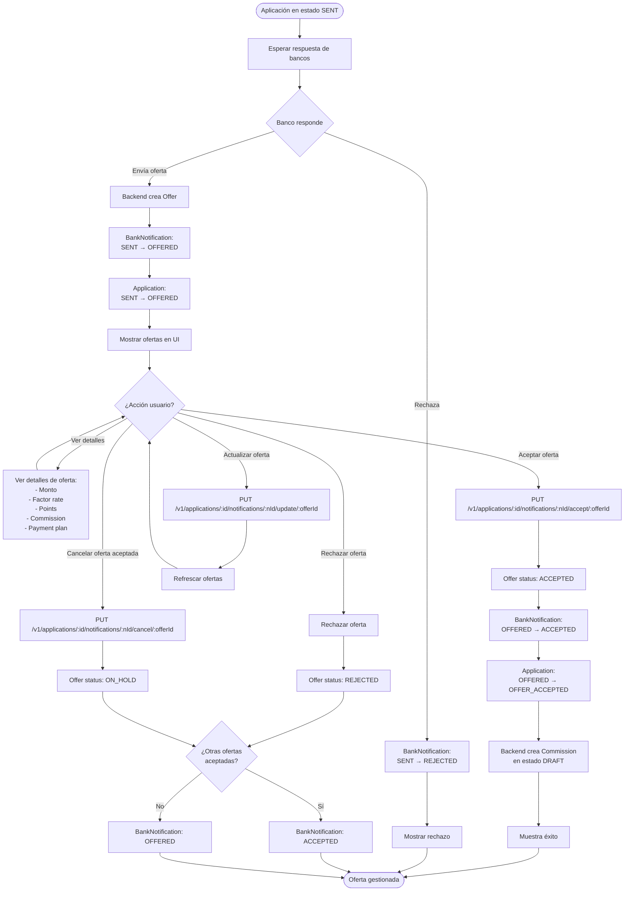

#### Diagrama de Flujo: Completar Aplicación

```mermaid
flowchart TD
    Start([Aplicación en estado OFFER_ACCEPTED]) --> CheckSubstatus{¿Tiene substatus?}
    CheckSubstatus -->|No| UpdateSubstatus[Actualizar substatus:<br/>- CONTRACT_REQUESTED<br/>- CONTRACT_SENT_TO_CUSTOMER<br/>- CONTRACT_SIGNED<br/>- CONTRACT_NOT_SIGNED<br/>- CONTRACT_VERIFICATION<br/>- VERIFICATION_CALL]
    UpdateSubstatus --> PUTSubstatus[PUT /v1/applications/:id/substatus]
    PUTSubstatus --> UpdateSubstatusDone[Substatus actualizado]
    CheckSubstatus -->|Sí| UpdateSubstatusDone
    
    UpdateSubstatusDone --> CheckReady{¿Lista para completar?}
    CheckReady -->|No| ContinueWork[Continuar trabajo]
    ContinueWork --> CheckReady
    CheckReady -->|Sí| CompleteApp[Completar aplicación]
    
    CompleteApp --> PUTComplete[PUT /v1/applications/:id/complete]
    PUTComplete --> APIResponse{¿Éxito?}
    APIResponse -->|Error| ShowError[Muestra error]
    ShowError --> CompleteApp
    APIResponse -->|Éxito| UpdateStatus[Estado: OFFER_ACCEPTED → COMPLETED]
    UpdateStatus --> ReloadPage[Recargar página]
    ReloadPage --> End([Aplicación completada])
```

#### Casos Edge y Manejo de Errores

**1. Validación de Archivos Duplicados**:
```typescript
// En CreateApplicationService
this.form.addValidators((abstractControl: AbstractControl) => {
  const files = [
    ...bank_statements.map(s => s.statement?.file?.name),
    ...additional_statements.map(s => s.statement?.file?.name),
    ...credit_card_statements.map(s => s.statement?.file?.name),
    mtd_statements?.file?.name,
  ].filter(Boolean);
  
  return new Set(files).size !== files.length 
    ? { FILE_DUPLICATED: true } 
    : null;
});
```

**2. Cálculo Dinámico de Períodos**:
- Si la company tiene aplicaciones previas, calcula períodos desde la última
- Si no, usa los últimos 4 períodos desde hoy
- Se actualiza automáticamente cuando cambia la company seleccionada

**3. Manejo de Errores HTTP**:
```typescript
// En ApplicationsDetailsComponent
catchError((error: HttpErrorResponse) =>
  this.errorHandlerService.resolveNotFound(
    error, 
    '/applications', 
    'Application not found'
  )
)
```

**4. Sincronización de Estados**:
- Cuando se acepta una oferta, se actualiza automáticamente el estado de la aplicación
- Si hay múltiples ofertas aceptadas, la aplicación queda en OFFER_ACCEPTED
- Si se cancelan todas, vuelve a OFFERED

### 11.4 Lógica de Negocio

#### Reglas de Negocio Implementadas

**1. Validación de Monto**:
- Mínimo: $1,000
- Máximo: $20,000,000
- Solo números enteros (pattern: `/^\d+$/`)

**2. Documentos Requeridos**:
- **Bank Statements**: 4 períodos (calculados dinámicamente)
- **MTD Statement**: 1 período (opcional pero recomendado)
- **Credit Card Statements**: 3 períodos (opcionales)
- **Additional Statements**: Máximo 5 (opcionales)
- **Filled Applications**: Opcional

**3. Estados y Transiciones**:
```typescript
// Transiciones válidas:
READY_TO_SEND → SENT (al enviar a bancos)
SENT → OFFERED (banco envía oferta)
SENT → REJECTED (banco rechaza)
OFFERED → OFFER_ACCEPTED (aceptar oferta)
OFFERED → REJECTED (rechazar todas las ofertas)
OFFER_ACCEPTED → COMPLETED (completar manualmente)
Cualquier estado → REJECTED (rechazar aplicación)
```

**4. Posición de Aplicación**:
- Valores: 1, 2, 3, 4, 5
- 1 = Mayor prioridad
- 5 = Menor prioridad
- Requerida antes de enviar a bancos
- Usada por bancos para priorizar procesamiento

**5. Envío a Bancos**:
- Solo aplicaciones en estado `READY_TO_SEND` pueden enviarse
- Debe tener posición establecida
- Puede enviarse a múltiples bancos simultáneamente
- Mensaje opcional (15-800 caracteres)

**6. Gestión de Ofertas**:
- Un banco puede enviar múltiples ofertas
- Solo una oferta puede estar aceptada por notificación
- Si se acepta una oferta, se crea automáticamente una comisión
- Las ofertas pueden actualizarse antes de aceptar
- Las ofertas aceptadas pueden cancelarse (ON_HOLD)

**7. Eliminación de Aplicaciones**:
- Solo aplicaciones en estado `READY_TO_SEND` pueden eliminarse
- Requiere permiso `DELETE_APPLICATION`

**8. Transferencia de Aplicaciones**:
- Puede transferirse a cualquier usuario activo
- No puede transferirse si está en estado `COMPLETED`
- Requiere permiso `TRANSFER_APPLICATION`

**9. Cálculo de Períodos**:
- Si la company tiene aplicaciones previas, usa el último período válido
- Calcula períodos requeridos desde ese punto
- Si no hay aplicaciones previas, usa los últimos 4 períodos desde hoy

#### Validaciones Específicas del Dominio

**1. Validación de Documentos**:
```typescript
// appDocumentValidator
- Debe tener archivo
- Debe tener período (para bank/credit card statements)
- Debe tener amount, transactions, negative_days
- El archivo debe ser válido
```

**2. Validación de Formulario Multi-Paso**:
- Paso 1: Company, monto, producto son requeridos
- Paso 2: Todos los bank statements deben tener archivo
- Paso 3: MTD y credit card son opcionales, pero si se suben deben ser válidos

**3. Validación de Mensaje a Bancos**:
- Mínimo: 15 caracteres
- Máximo: 800 caracteres
- Requerido

**4. Validación de Selección de Bancos**:
- Al menos un banco debe seleccionarse
- Los bancos no pueden estar en blacklist (validado en backend)

### 11.5 Integraciones

#### Integración con Otros Módulos

**1. Companies Module**:
- **Dependencia**: Applications requiere una Company existente
- **Flujo**: 
  - Usuario selecciona Company al crear aplicación
  - Se obtiene `lastValidPeriod` de la company
  - Se muestra información de la company en detalles
  - Link a company details desde application details

**2. Banks Module**:
- **Dependencia**: Applications envía a Banks
- **Flujo**:
  - Obtiene lista de bancos disponibles
  - Obtiene bancos recomendados para la aplicación
  - Crea BankNotifications cuando se envía
  - Recibe ofertas de bancos

**3. Commissions Module**:
- **Dependencia**: Applications genera Commissions
- **Flujo**:
  - Cuando se acepta una oferta, se crea automáticamente una Commission
  - La commission está en estado DRAFT
  - Link a commission details desde application details

**4. Contacts Module**:
- **Relación Indirecta**: A través de Companies
- **Flujo**:
  - Los miembros de la company son Contacts
  - Se muestran en application details
  - Link a contact details desde application details

**5. Leads Module**:
- **Relación Indirecta**: A través de Companies
- **Flujo**:
  - Los leads se convierten en Contacts/Companies
  - Esas companies crean Applications

#### Dependencias y Acoplamientos

**Dependencias Directas**:
- `ApplicationsService` → `HttpService` (comunicación HTTP)
- `ApplicationsService` → `BankService` (obtener bancos)
- `ApplicationsService` → `UserService` (transferir aplicación)
- `CreateApplicationService` → `ApplicationsService` (crear aplicación)
- `ApplicationDetailsService` → Signals (estado local)

**Acoplamientos**:
- **Bajo acoplamiento**: Cada componente tiene responsabilidades claras
- **Alto cohesión**: Componentes relacionados están agrupados
- **Dependencia de interfaces**: Usa interfaces TypeScript para desacoplar

#### APIs y Servicios Externos

**1. Backend API** (`/v1/applications`):
- Todos los endpoints están bajo `/v1/applications`
- Usa FormData para requests con archivos
- Autenticación vía JWT (Auth0 interceptor)

**2. Auth0**:
- Autenticación de usuarios
- Permisos en JWT token
- Interceptor inyecta tokens automáticamente

**3. NotificationAPI** (Indirecto):
- Notificaciones en tiempo real cuando hay cambios
- WebSocket para actualizaciones

### 11.6 Casos de Uso

#### Caso de Uso 1: Agente Crea y Envía Aplicación

**Escenario**:
Un agente tiene un cliente (Company) que necesita un préstamo de $50,000.

**Flujo**:
1. Agente navega a Applications → Create
2. Selecciona la Company del cliente
3. Completa: Monto $50,000, Producto "Term Loan", Referral "Website"
4. Sube 4 bank statements (períodos calculados automáticamente)
5. Sube MTD statement y 2 credit card statements
6. Añade 2 additional statements
7. Envía → Aplicación creada en estado `READY_TO_SEND`
8. Establece posición 2 (alta prioridad)
9. Selecciona 5 bancos recomendados
10. Escribe mensaje: "High-quality client with strong financials"
11. Envía a bancos → Estado cambia a `SENT`
12. Se crean 5 BankNotifications (una por banco)

**Resultado**: Aplicación enviada a 5 bancos, esperando respuestas.

#### Caso de Uso 2: Múltiples Bancos Responden con Ofertas

**Escenario**:
3 de los 5 bancos responden con ofertas, 1 rechaza, 1 no responde aún.

**Flujo**:
1. Banco A envía oferta: $50,000, factor rate 1.25, commission $2,500
2. Banco B envía oferta: $48,000, factor rate 1.20, commission $2,400
3. Banco C envía oferta: $52,000, factor rate 1.30, commission $2,600
4. Banco D rechaza: "Does not meet minimum requirements"
5. Sistema actualiza:
   - 3 BankNotifications: SENT → OFFERED
   - 1 BankNotification: SENT → REJECTED
   - 1 BankNotification: SENT (pendiente)
   - Application: SENT → OFFERED
6. Agente compara ofertas:
   - Banco B tiene mejor factor rate (1.20)
   - Banco C ofrece más monto ($52,000)
   - Banco A es intermedio
7. Agente acepta oferta de Banco C (mayor monto)
8. Sistema:
   - Offer status: ACCEPTED
   - BankNotification: OFFERED → ACCEPTED
   - Application: OFFERED → OFFER_ACCEPTED
   - Commission creada automáticamente (DRAFT)

**Resultado**: Oferta aceptada, comisión creada, aplicación lista para completar.

#### Caso de Uso 3: Supervisor Transfiere Aplicación

**Escenario**:
Un agente se va de vacaciones y tiene una aplicación importante que necesita seguimiento.

**Flujo**:
1. Supervisor accede a Applications
2. Encuentra aplicación en estado `OFFERED`
3. Hace click en botón de transferir
4. Busca usuario de reemplazo
5. Selecciona usuario activo
6. Confirma transferencia
7. Sistema:
   - `PUT /v1/applications/:id/transfer-to/:userId`
   - Aplicación ahora pertenece al nuevo usuario
8. Nuevo usuario recibe notificación
9. Nuevo usuario puede gestionar la aplicación

**Resultado**: Aplicación transferida exitosamente.

#### Caso de Uso 4: Rechazar Aplicación

**Escenario**:
El cliente decide no proceder con el préstamo después de recibir ofertas.

**Flujo**:
1. Agente accede a application details
2. Hace click en "Close" (rechazar)
3. Selecciona razón de rechazo: "Customer declined"
4. Opcionalmente añade descripción
5. Confirma rechazo
6. Sistema:
   - `PATCH /v1/applications/:id/reject`
   - Estado: Cualquier → REJECTED
   - Se guarda razón y descripción
7. Todas las notificaciones pendientes se marcan como rechazadas

**Resultado**: Aplicación rechazada, no puede continuar el proceso.

#### Caso de Uso 5: Completar Aplicación con Subestado

**Escenario**:
Oferta aceptada, ahora se sigue el proceso de financiamiento.

**Flujo**:
1. Aplicación en estado `OFFER_ACCEPTED`
2. Agente actualiza substatus: "CONTRACT_REQUESTED"
3. Cuando se envía contrato: "CONTRACT_SENT_TO_CUSTOMER"
4. Cuando cliente firma: "CONTRACT_SIGNED"
5. Verificación: "CONTRACT_VERIFICATION"
6. Llamada de verificación: "VERIFICATION_CALL"
7. Una vez financiado, agente hace click en "Complete"
8. Sistema:
   - `PUT /v1/applications/:id/complete`
   - Estado: OFFER_ACCEPTED → COMPLETED
9. Página se recarga, aplicación bloqueada para edición

**Resultado**: Aplicación completada, proceso finalizado.

#### Flujos Alternativos y Excepciones

**Alternativa 1: Crear Oferta Manualmente**
- Si un banco no responde vía sistema, un usuario con permisos puede crear oferta manualmente
- Flujo: Ver notificación → Crear oferta → Ingresar detalles → Guardar

**Alternativa 2: Restaurar Notificación Rechazada**
- Si se rechazó por error, puede restaurarse
- Flujo: Ver notificación rechazada → Restaurar → Estado vuelve a SENT

**Alternativa 3: Actualizar Oferta**
- Si una oferta tiene errores, puede actualizarse antes de aceptar
- Flujo: Ver oferta → Actualizar → Modificar campos → Guardar

**Excepción 1: Archivos Duplicados**
- Si se suben archivos con el mismo nombre, se muestra error
- Usuario debe renombrar o eliminar duplicados

**Excepción 2: Company Sin Aplicaciones Previas**
- Si la company es nueva, se usan los últimos 4 períodos desde hoy
- No hay cálculo especial, solo períodos estándar

**Excepción 3: Banco en Blacklist**
- Los bancos en blacklist no aparecen en recomendados
- Pueden buscarse manualmente, pero backend rechazará el envío

**Excepción 4: Aplicación Bloqueada**
- Si está COMPLETED o REJECTED, no puede editarse
- Solo puede verse información, no modificarse

---

## 12. FLUJOS COMPLETOS DE PROCESOS - TRAZABILIDAD DETALLADA

Esta sección documenta los flujos completos de todos los procesos principales de la aplicación, incluyendo cada paso, validación, transformación de datos, llamadas a APIs, cambios de estado y manejo de errores.

---

### 12.1 FLUJO COMPLETO: Lead → Contact → Company → Application

**Descripción**: Flujo end-to-end desde la importación de un lead hasta la creación de una aplicación de préstamo.

#### Diagrama de Flujo

```mermaid
flowchart TD
    Start([Usuario: Agente/Marketing]) --> Auth{¿Autenticado?}
    Auth -->|No| Auth0[Auth0 Login]
    Auth0 --> LoadPerms[Cargar Permisos JWT]
    Auth -->|Sí| LoadPerms
    
    LoadPerms --> CheckPerms{¿Tiene permiso<br/>CREATE_LEAD?}
    CheckPerms -->|No| NoAccess[Redirigir a /applications]
    CheckPerms -->|Sí| CreateLead[Navegar a /leads/create]
    
    CreateLead --> UploadFile[Paso 1: Subir archivo CSV/Excel]
    UploadFile --> ValidateFile{¿Archivo válido?}
    ValidateFile -->|No| ShowFileError[Error: Archivo inválido]
    ShowFileError --> UploadFile
    ValidateFile -->|Sí| FillForm[Paso 2: Completar formulario]
    
    FillForm --> EnterName[Ingresar nombre del grupo]
    EnterName --> SelectUser[Seleccionar usuario asignado]
    SelectUser --> ValidateForm{¿Formulario válido?}
    ValidateForm -->|No| ShowFormErrors[Mostrar errores]
    ShowFormErrors --> FillForm
    ValidateForm -->|Sí| SubmitLead[Enviar: POST /v1/leads]
    
    SubmitLead --> CreateFormData[Crear FormData:<br/>file + body JSON]
    CreateFormData --> APIRequest1[POST /v1/leads<br/>Body: FormData]
    APIRequest1 --> APIResponse1{¿Éxito?}
    APIResponse1 -->|Error| HandleError1[Manejar error HTTP]
    HandleError1 --> ShowAPIError1[Mostrar error al usuario]
    ShowAPIError1 --> SubmitLead
    
    APIResponse1 -->|Éxito| ProcessFile[Backend procesa archivo]
    ProcessFile --> CreateLeadGroup[Backend crea LeadGroup]
    CreateLeadGroup --> CreateProspects[Backend crea múltiples Prospects<br/>desde CSV/Excel]
    CreateProspects --> ReturnSkipped[Retornar filas omitidas<br/>duplicados/errores]
    ReturnSkipped --> CheckSkipped{¿Hay filas<br/>omitidas?}
    
    CheckSkipped -->|Sí| ShowSkipped[Mostrar filas omitidas]
    ShowSkipped --> NavigateLeads[Navegar a /leads]
    CheckSkipped -->|No| NavigateLeads
    
    NavigateLeads --> ViewLeads[Lista de LeadGroups]
    ViewLeads --> SelectLeadGroup[Seleccionar LeadGroup]
    SelectLeadGroup --> ViewProspects[Lista de Prospects]
    ViewProspects --> SelectProspect[Seleccionar Prospect]
    SelectProspect --> ProspectDetails[GET /v1/leads/:leadId/prospects/:prospectId]
    ProspectDetails --> DisplayProspect[Mostrar detalles del Prospect]
    
    DisplayProspect --> WorkProspect[Gestionar Prospect]
    WorkProspect --> AddNote{¿Añadir nota?}
    AddNote -->|Sí| CreateNote[POST /v1/leads/:leadId/prospects/:prospectId/notes]
    CreateNote --> WorkProspect
    AddNote -->|No| MakeCall{¿Hacer llamada?}
    
    MakeCall -->|Sí| RequestCall[POST /v1/users/make-a-call<br/>entity_type: PROSPECT]
    RequestCall --> VoIPSystem[Sistema VoIP inicia llamada]
    VoIPSystem --> LogCall[Registrar llamada en call_history]
    LogCall --> WorkProspect
    MakeCall -->|No| Qualified{¿Prospect<br/>calificado?}
    
    Qualified -->|No| WorkProspect
    Qualified -->|Sí| CreateContact[Navegar a /contacts/create]
    
    CreateContact --> CheckPerms2{¿Tiene permiso<br/>CREATE_CONTACT?}
    CheckPerms2 -->|No| NoAccess2[Redirigir]
    CheckPerms2 -->|Sí| FillContactForm[Completar formulario Contact]
    
    FillContactForm --> Step1[Paso 1: Información básica<br/>- Nombre, apellido<br/>- Fecha nacimiento 21-99 años<br/>- SSN/ITIN<br/>- Tipo identificación]
    Step1 --> ValidateStep1{¿Válido?}
    ValidateStep1 -->|No| ShowErrors1[Mostrar errores]
    ShowErrors1 --> Step1
    ValidateStep1 -->|Sí| Step2[Paso 2: Dirección<br/>- País, estado, ciudad<br/>- Dirección completa]
    Step2 --> ValidateStep2{¿Válido?}
    ValidateStep2 -->|No| ShowErrors2[Mostrar errores]
    ShowErrors2 --> Step2
    ValidateStep2 -->|Sí| Step3[Paso 3: Documentos<br/>- Máx 6 documentos<br/>- Máx 4 por tipo<br/>- Máx 10MB por archivo]
    Step3 --> ValidateStep3{¿Válido?}
    ValidateStep3 -->|No| ShowErrors3[Mostrar errores]
    ShowErrors3 --> Step3
    ValidateStep3 -->|Sí| Step4[Paso 4: Notas opcionales<br/>- Nivel: INFO/WARNING/CRITICAL]
    Step4 --> SubmitContact[Enviar: POST /v1/contacts]
    
    SubmitContact --> CreateFormData2[Crear FormData:<br/>body JSON + documentos]
    CreateFormData2 --> APIRequest2[POST /v1/contacts<br/>Body: FormData]
    APIRequest2 --> APIResponse2{¿Éxito?}
    APIResponse2 -->|Error| HandleError2[Manejar error]
    HandleError2 --> ShowAPIError2[Mostrar error]
    ShowAPIError2 --> SubmitContact
    
    APIResponse2 -->|Éxito| CreateContactEntity[Backend crea Contact]
    CreateContactEntity --> LinkProspect[Backend vincula Prospect → Contact<br/>preserva historial]
    LinkProspect --> ContactCreated[Contact creado exitosamente]
    ContactCreated --> NavigateContact[Navegar a /contacts/:id]
    
    NavigateContact --> ViewContact[Ver detalles Contact]
    ViewContact --> CreateCompany{¿Crear Company<br/>para este Contact?}
    CreateCompany -->|No| EndContact[Fin: Contact creado]
    CreateCompany -->|Sí| CreateCompanyNav[Navegar a /companies/create]
    
    CreateCompanyNav --> CheckPerms3{¿Tiene permiso<br/>CREATE_COMPANY?}
    CheckPerms3 -->|No| NoAccess3[Redirigir]
    CheckPerms3 -->|Sí| FillCompanyForm[Completar formulario Company]
    
    FillCompanyForm --> CompStep1[Paso 1: Información básica<br/>- Nombre, DBA<br/>- EIN/Tax ID<br/>- Industria<br/>- Tipo entidad<br/>- Fecha creación]
    CompStep1 --> ValidateComp1{¿Válido?}
    ValidateComp1 -->|No| ShowCompErrors1[Mostrar errores]
    ShowCompErrors1 --> CompStep1
    ValidateComp1 -->|Sí| CompStep2[Paso 2: Dirección y contacto<br/>- Dirección completa<br/>- Teléfonos máx 5<br/>- Emails máx 5<br/>- Servicio]
    CompStep2 --> ValidateComp2{¿Válido?}
    ValidateComp2 -->|No| ShowCompErrors2[Mostrar errores]
    ShowCompErrors2 --> CompStep2
    ValidateComp2 -->|Sí| CompStep3[Paso 3: Miembros<br/>- Asociar Contact como miembro<br/>- Título, porcentaje<br/>- Fecha desde miembro<br/>- Máx 10 miembros]
    CompStep3 --> ValidateComp3{¿Válido?}
    ValidateComp3 -->|No| ShowCompErrors3[Mostrar errores]
    ShowCompErrors3 --> CompStep3
    ValidateComp3 -->|Sí| CompStep4[Paso 4: Documentos<br/>- EIN, W-9, Voided Check, etc.<br/>- Máx 4 por tipo<br/>- Máx 10MB por archivo]
    CompStep4 --> ValidateComp4{¿Válido?}
    ValidateComp4 -->|No| ShowCompErrors4[Mostrar errores]
    ShowCompErrors4 --> CompStep4
    ValidateComp4 -->|Sí| CompStep5[Paso 5: Notas opcionales]
    CompStep5 --> SubmitCompany[Enviar: POST /v1/companies]
    
    SubmitCompany --> CreateFormData3[Crear FormData:<br/>body JSON + documentos]
    CreateFormData3 --> APIRequest3[POST /v1/companies<br/>Body: FormData]
    APIRequest3 --> APIResponse3{¿Éxito?}
    APIResponse3 -->|Error| HandleError3[Manejar error]
    HandleError3 --> ShowAPIError3[Mostrar error]
    ShowAPIError3 --> SubmitCompany
    
    APIResponse3 -->|Éxito| CreateCompanyEntity[Backend crea Company]
    CreateCompanyEntity --> LinkMembers[Backend asocia Contact como miembro]
    LinkMembers --> CompanyCreated[Company creada exitosamente]
    CompanyCreated --> NavigateCompany[Navegar a /companies/:id]
    
    NavigateCompany --> ViewCompany[Ver detalles Company]
    ViewCompany --> CreateApplication{¿Crear Application<br/>desde esta Company?}
    CreateApplication -->|No| EndCompany[Fin: Company creada]
    CreateApplication -->|Sí| CreateAppNav[Navegar a /applications/create]
    
    CreateAppNav --> CheckPerms4{¿Tiene permiso<br/>CREATE_APPLICATION?}
    CheckPerms4 -->|No| NoAccess4[Redirigir]
    CheckPerms4 -->|Sí| FillAppForm[Completar formulario Application]
    
    FillAppForm --> AppStep1[Paso 1: Detalles<br/>- Seleccionar Company<br/>- Monto $1K-$20M<br/>- Producto<br/>- Referral opcional]
    AppStep1 --> SelectCompany[Seleccionar Company]
    SelectCompany --> CalcPeriods[Calcular períodos requeridos<br/>GET /v1/last-application-period/:companyId]
    CalcPeriods --> GetPeriods{¿Company tiene<br/>aplicaciones previas?}
    GetPeriods -->|Sí| UseLastPeriod[Usar último período válido<br/>calcular desde ahí]
    GetPeriods -->|No| UseDefault[Usar últimos 4 períodos<br/>desde hoy]
    UseLastPeriod --> AppStep2[Paso 2: Bank Statements<br/>- 4 períodos requeridos<br/>- Subir archivos]
    UseDefault --> AppStep2
    
    AppStep2 --> ValidateApp2{¿Todos los statements<br/>válidos?}
    ValidateApp2 -->|No| ShowAppErrors2[Mostrar errores]
    ShowAppErrors2 --> AppStep2
    ValidateApp2 -->|Sí| AppStep3[Paso 3: Additional Statements<br/>- MTD opcional<br/>- Credit Card 3 períodos opcionales<br/>- Additional máx 5 opcionales]
    AppStep3 --> ValidateFiles{¿Archivos<br/>duplicados?}
    ValidateFiles -->|Sí| ShowDuplicateError[Error: Archivos duplicados]
    ShowDuplicateError --> AppStep3
    ValidateFiles -->|No| ValidateApp3{¿Válido?}
    ValidateApp3 -->|No| ShowAppErrors3[Mostrar errores]
    ShowAppErrors3 --> AppStep3
    ValidateApp3 -->|Sí| SubmitApplication[Enviar: POST /v1/applications]
    
    SubmitApplication --> CreateFormData4[Crear FormData:<br/>body JSON + todos los archivos]
    CreateFormData4 --> APIRequest4[POST /v1/applications<br/>Body: FormData]
    APIRequest4 --> APIResponse4{¿Éxito?}
    APIResponse4 -->|Error| HandleError4[Manejar error]
    HandleError4 --> ShowAPIError4[Mostrar error]
    ShowAPIError4 --> SubmitApplication
    
    APIResponse4 -->|Éxito| CreateAppEntity[Backend crea Application]
    CreateAppEntity --> SetStatus[Estado: READY_TO_SEND]
    SetStatus --> AppCreated[Application creada exitosamente]
    AppCreated --> NavigateApp[Navegar a /applications/:id]
    
    NavigateApp --> End([FIN: Application creada<br/>Lista para enviar a bancos])
    
    NoAccess --> End
    NoAccess2 --> End
    NoAccess3 --> End
    NoAccess4 --> End
    EndContact --> End
    EndCompany --> End
```

#### Explicación Paso a Paso

**FASE 1: Crear Lead desde CSV/Excel**

1. **Punto de Entrada**: Usuario (Agente/Marketing) autenticado con permiso `CREATE_LEAD`
2. **Navegación**: `/leads/create`
3. **Validación de Permisos**: `PermissionGuard` verifica `CREATE_LEAD`
4. **Subir Archivo**:
   - Usuario selecciona archivo CSV/Excel
   - Validación: archivo debe ser válido
   - FormData: `file` + `body` (JSON con nombre y usuario asignado)
5. **API Call**: `POST /v1/leads`
   - Backend procesa archivo
   - Crea `LeadGroup` con múltiples `Prospects`
   - Retorna filas omitidas (duplicados, errores)
6. **Transformación de Datos**:
   - CSV/Excel → Array de objetos Prospect
   - Validación de campos requeridos
   - Detección de duplicados
7. **Resultado**: LeadGroup creado con N Prospects

**FASE 2: Gestionar Prospect**

1. **Navegación**: `/leads/:leadId/prospects/:prospectId`
2. **Cargar Prospect**: `GET /v1/leads/:leadId/prospects/:prospectId`
3. **Operaciones Disponibles**:
   - Añadir notas: `POST /v1/leads/:leadId/prospects/:prospectId/notes`
   - Hacer llamada: `POST /v1/users/make-a-call` (entity_type: PROSPECT)
   - Registrar llamada en `call_history`
4. **Validación**: Prospect debe estar calificado antes de convertir

**FASE 3: Crear Contact desde Prospect**

1. **Navegación**: `/contacts/create`
2. **Validación de Permisos**: `CREATE_CONTACT`
3. **Formulario Multi-Paso**:
   - **Paso 1**: Información básica (nombre, SSN, edad 21-99)
   - **Paso 2**: Dirección completa
   - **Paso 3**: Documentos (máx 6, máx 4 por tipo, máx 10MB)
   - **Paso 4**: Notas opcionales
4. **Validaciones**:
   - Edad: 21-99 años
   - Máximo 5 teléfonos
   - Máximo 5 emails
   - Máximo 6 documentos totales
5. **API Call**: `POST /v1/contacts` (FormData)
6. **Transformación**:
   - Prospect data → Contact data
   - Backend vincula Prospect → Contact (preserva historial)
7. **Resultado**: Contact creado, vinculado al Prospect original

**FASE 4: Crear Company y Asociar Contact**

1. **Navegación**: `/companies/create`
2. **Validación de Permisos**: `CREATE_COMPANY`
3. **Formulario Multi-Paso**:
   - **Paso 1**: Información básica (nombre, EIN, industria, tipo entidad)
   - **Paso 2**: Dirección y contacto
   - **Paso 3**: Miembros (asociar Contact creado, máx 10)
   - **Paso 4**: Documentos (máx 4 por tipo)
   - **Paso 5**: Notas opcionales
4. **Validaciones**:
   - Máximo 10 miembros
   - Máximo 4 documentos por tipo
5. **API Call**: `POST /v1/companies` (FormData)
6. **Transformación**:
   - Contact → CompanyMember
   - Asociación: Company tiene N Members (Contacts)
7. **Resultado**: Company creada con Contact como miembro

**FASE 5: Crear Application desde Company**

1. **Navegación**: `/applications/create`
2. **Validación de Permisos**: `CREATE_APPLICATION`
3. **Formulario Multi-Paso**:
   - **Paso 1**: Detalles (Company, monto $1K-$20M, producto, referral)
   - **Paso 2**: Bank Statements (4 períodos requeridos)
   - **Paso 3**: Additional Statements (MTD, credit card, additional)
4. **Cálculo Dinámico de Períodos**:
   - Si Company tiene aplicaciones previas: `GET /v1/last-application-period/:companyId`
   - Calcula períodos desde último período válido
   - Si no: usa últimos 4 períodos desde hoy
5. **Validaciones**:
   - Monto: $1,000 - $20,000,000 (solo enteros)
   - Bank statements: 4 períodos requeridos
   - No archivos duplicados (validación global)
6. **API Call**: `POST /v1/applications` (FormData: body + archivos)
7. **Transformación**:
   - Formulario → Application entity
   - Archivos → ApplicationDocuments
   - Estado inicial: `READY_TO_SEND`
8. **Resultado**: Application creada, lista para enviar a bancos

**Manejo de Errores**:
- Validaciones de formulario: errores mostrados en UI
- Errores HTTP: `ErrorHandlerService` maneja y muestra mensajes
- Archivos duplicados: validación previene antes de enviar
- Errores de permisos: redirección a `/applications`

**Notificaciones**:
- Toast notifications para éxito/error
- NotificationAPI para cambios importantes (si está configurado)

**Punto de Salida**: Application en estado `READY_TO_SEND`, lista para enviar a bancos

---

### 12.2 FLUJO: Enviar Application a Bancos

**Descripción**: Proceso completo de envío de una aplicación a múltiples bancos.

#### Diagrama de Flujo

```mermaid
flowchart TD
    Start([Application en estado READY_TO_SEND]) --> CheckPerms{¿Tiene permiso<br/>SEND_APPLICATION?}
    CheckPerms -->|No| NoAccess[Sin acceso]
    CheckPerms -->|Sí| LoadApp[GET /v1/applications/:id]
    
    LoadApp --> CheckStatus{¿Estado es<br/>READY_TO_SEND?}
    CheckStatus -->|No| WrongStatus[Error: Solo READY_TO_SEND<br/>puede enviarse]
    CheckStatus -->|Sí| CheckPosition{¿Tiene posición<br/>1-5?}
    
    CheckPosition -->|No| SetPositionUI[Mostrar PositionSelector]
    SetPositionUI --> SelectPosition[Usuario selecciona posición 1-5]
    SelectPosition --> UpdatePosition[PATCH /v1/applications/:id/position/:position]
    UpdatePosition --> PositionResponse{¿Éxito?}
    PositionResponse -->|Error| HandlePosError[Manejar error]
    HandlePosError --> SelectPosition
    PositionResponse -->|Éxito| PositionSet[Posición establecida]
    CheckPosition -->|Sí| PositionSet
    
    PositionSet --> LoadBanks[Cargar bancos disponibles]
    LoadBanks --> CheckSearch{¿Usuario busca<br/>bancos?}
    CheckSearch -->|Sí| SearchBanks[GET /v1/banks?search=query&limit=10]
    CheckSearch -->|No| GetRecommended[GET /v1/applications/:id/recommended-banks]
    
    SearchBanks --> FilterBanks[Filtrar bancos en blacklist]
    GetRecommended --> FilterBanks
    FilterBanks --> DisplayBanks[Mostrar bancos disponibles]
    
    DisplayBanks --> SelectBanks[Usuario selecciona bancos<br/>múltiples selección]
    SelectBanks --> ValidateSelection{¿Al menos<br/>un banco?}
    ValidateSelection -->|No| ShowSelectionError[Error: Seleccionar al menos un banco]
    ShowSelectionError --> SelectBanks
    ValidateSelection -->|Sí| WriteMessage[Escribir mensaje opcional<br/>15-800 caracteres]
    
    WriteMessage --> ValidateMessage{¿Mensaje válido?<br/>15-800 chars}
    ValidateMessage -->|No| ShowMessageError[Error: Mensaje inválido]
    ShowMessageError --> WriteMessage
    ValidateMessage -->|Sí| ValidateForm{¿Formulario<br/>completo?}
    
    ValidateForm -->|No| ShowFormErrors[Mostrar errores]
    ShowFormErrors --> SelectBanks
    ValidateForm -->|Sí| SubmitSend[Enviar a bancos]
    
    SubmitSend --> CreateRequest[Crear request:<br/>{message: string, bank_ids: string[]}]
    CreateRequest --> APIRequest[PUT /v1/applications/:id/notifications]
    APIRequest --> APIResponse{¿Éxito?}
    
    APIResponse -->|Error| HandleError[Manejar error HTTP]
    HandleError --> CheckErrorType{¿Tipo error?}
    CheckErrorType -->|400| ValidationError[Error de validación<br/>mostrar mensaje]
    CheckErrorType -->|403| PermissionError[Error de permisos]
    CheckErrorType -->|404| NotFoundError[Application no encontrada]
    CheckErrorType -->|500| ServerError[Error del servidor]
    ValidationError --> SubmitSend
    PermissionError --> NoAccess
    NotFoundError --> Redirect[Redirigir a /applications]
    ServerError --> ShowRetry[Mostrar opción de reintentar]
    ShowRetry --> SubmitSend
    
    APIResponse -->|Éxito| ProcessBackend[Backend procesa envío]
    ProcessBackend --> ValidateBanks{¿Bancos válidos?<br/>No en blacklist?}
    ValidateBanks -->|No| RejectBanks[Rechazar bancos inválidos<br/>retornar error]
    RejectBanks --> ShowInvalidBanks[Mostrar bancos inválidos]
    ShowInvalidBanks --> SelectBanks
    ValidateBanks -->|Sí| CreateNotifications[Backend crea BankNotifications<br/>una por cada banco]
    
    CreateNotifications --> SetNotifStatus[BankNotification status: PENDING]
    SetNotifStatus --> ProcessNotif[Backend procesa cada notificación]
    ProcessNotif --> SendToBank{¿Enviar a banco?}
    SendToBank -->|Sí| SendEmail[Backend envía email/notificación<br/>al banco externo]
    SendEmail --> SetNotifSent[BankNotification status: SENT]
    SendToBank -->|No| QueueNotif[Encolar notificación<br/>para procesar después]
    QueueNotif --> SetNotifSent
    
    SetNotifSent --> UpdateAppStatus[Actualizar Application status:<br/>READY_TO_SEND → SENT]
    UpdateAppStatus --> ReturnResponse[Retornar respuesta exitosa]
    ReturnResponse --> RefreshUI[Refrescar UI]
    RefreshUI --> LoadNotifications[GET /v1/applications/:id/notifications]
    LoadNotifications --> DisplayNotifications[Mostrar notificaciones creadas]
    DisplayNotifications --> ShowSuccess[Mostrar notificación de éxito]
    ShowSuccess --> UpdateTab[Cambiar tab a 'notifications']
    UpdateTab --> End([FIN: Application enviada<br/>Estado: SENT<br/>N BankNotifications creadas])
    
    NoAccess --> End
    WrongStatus --> End
    Redirect --> End
```

#### Explicación Paso a Paso

1. **Punto de Entrada**: Application en estado `READY_TO_SEND`, usuario con permiso `SEND_APPLICATION`

2. **Validación Inicial**:
   - Verificar permiso: `SEND_APPLICATION`
   - Verificar estado: debe ser `READY_TO_SEND`
   - Cargar aplicación: `GET /v1/applications/:id`

3. **Establecer Posición** (si no tiene):
   - Mostrar `PositionSelectorComponent`
   - Usuario selecciona posición 1-5
   - `PATCH /v1/applications/:id/position/:position`
   - Validación: posición debe ser 1-5

4. **Cargar Bancos**:
   - Si hay búsqueda: `GET /v1/banks?search=query&limit=10`
   - Si no: `GET /v1/applications/:id/recommended-banks`
   - Filtrar bancos en blacklist (no se muestran)

5. **Selección de Bancos**:
   - Usuario selecciona múltiples bancos
   - Validación: al menos un banco debe seleccionarse
   - UI muestra detalles relevantes de cada banco

6. **Mensaje Opcional**:
   - Usuario escribe mensaje (15-800 caracteres)
   - Validación: si se escribe, debe cumplir límites

7. **Envío**:
   - Crear request: `{message: string, bank_ids: string[]}`
   - `PUT /v1/applications/:id/notifications`

8. **Procesamiento Backend**:
   - Validar bancos (no en blacklist, activos)
   - Crear `BankNotification` por cada banco
   - Estado inicial: `PENDING`
   - Procesar cada notificación (enviar email/notificación al banco)
   - Estado: `PENDING → SENT`

9. **Actualización de Estado**:
   - Application: `READY_TO_SEND → SENT`
   - Cada BankNotification: `PENDING → SENT`

10. **Actualización UI**:
    - Refrescar notificaciones: `GET /v1/applications/:id/notifications`
    - Mostrar notificaciones creadas
    - Cambiar tab a 'notifications'
    - Mostrar toast de éxito

**Manejo de Errores**:
- **400**: Validación fallida (bancos inválidos, mensaje inválido)
- **403**: Sin permisos
- **404**: Application no encontrada
- **500**: Error del servidor (opción de reintentar)

**Transformaciones de Datos**:
- `bank_ids[]` → Array de `BankNotification` entities
- Cada notificación incluye: `bank`, `status`, `offers[]`, `created_at`

**Notificaciones**:
- Toast: "Application sent to banks successfully"
- NotificationAPI: Notificación en tiempo real (si configurado)

**Punto de Salida**: Application en estado `SENT`, N BankNotifications creadas (una por banco), esperando respuestas

---

### 12.3 FLUJO: Gestionar Ofertas y Aceptar

**Descripción**: Proceso completo desde recibir ofertas de bancos hasta aceptar una oferta y crear comisión.

#### Diagrama de Flujo

```mermaid
flowchart TD
    Start([Application en estado SENT]) --> WaitBanks[Esperar respuesta de bancos]
    WaitBanks --> BankResponds{Banco responde}
    
    BankResponds -->|Envía oferta| CreateOfferBackend[Backend crea Offer]
    CreateOfferBackend --> SetOfferData[Offer data:<br/>- purchased_amount<br/>- factor_rate<br/>- points<br/>- commission<br/>- payment_plan]
    SetOfferData --> AddToNotification[Añadir Offer a BankNotification.offers[]]
    AddToNotification --> CheckNotifStatus{¿BankNotification<br/>status es SENT?}
    CheckNotifStatus -->|Sí| UpdateNotifStatus[BankNotification:<br/>SENT → OFFERED]
    CheckNotifStatus -->|No| KeepStatus[Mantener status actual]
    UpdateNotifStatus --> CheckAppStatus{¿Application status<br/>es SENT?}
    KeepStatus --> CheckAppStatus
    CheckAppStatus -->|Sí| UpdateAppStatus[Application:<br/>SENT → OFFERED]
    CheckAppStatus -->|No| KeepAppStatus[Mantener status]
    UpdateAppStatus --> TriggerNotification[NotificationAPI:<br/>Nueva oferta recibida]
    KeepAppStatus --> TriggerNotification
    
    TriggerNotification --> UserNotified[Usuario recibe notificación]
    UserNotified --> RefreshUI[Usuario refresca página o<br/>sistema auto-refresca]
    RefreshUI --> LoadNotifications[GET /v1/applications/:id/notifications]
    LoadNotifications --> ProcessNotifications[Procesar notificaciones]
    ProcessNotifications --> CheckOffers{¿Notificación tiene<br/>ofertas y status SENT?}
    CheckOffers -->|Sí| AutoUpdateStatus[Actualizar status:<br/>SENT → OFFERED<br/>en frontend]
    CheckOffers -->|No| DisplayNotifications[Mostrar notificaciones]
    AutoUpdateStatus --> DisplayNotifications
    
    DisplayNotifications --> GroupByDate[Agrupar notificaciones por fecha]
    GroupByDate --> ShowOffers[Mostrar ofertas agrupadas]
    ShowOffers --> UserAction{¿Acción usuario?}
    
    UserAction -->|Ver detalles| ViewOffer[Ver detalles de oferta:<br/>- Monto<br/>- Factor rate<br/>- Points<br/>- Commission<br/>- Payment plan<br/>- Duración]
    ViewOffer --> UserAction
    
    UserAction -->|Aceptar oferta| AcceptOffer[PUT /v1/applications/:id/notifications/:nId/accept/:offerId]
    AcceptOffer --> ValidateAccept{¿Validaciones<br/>backend?}
    ValidateAccept -->|No| RejectAccept[Rechazar: Error de validación]
    RejectAccept --> ShowAcceptError[Mostrar error]
    ShowAcceptError --> UserAction
    ValidateAccept -->|Sí| ProcessAccept[Backend procesa aceptación]
    
    ProcessAccept --> UpdateOfferStatus[Offer status: ACCEPTED]
    UpdateOfferStatus --> UpdateNotifStatus2[BankNotification:<br/>OFFERED → ACCEPTED]
    UpdateNotifStatus2 --> CheckOtherOffers{¿Otras ofertas<br/>aceptadas en esta<br/>notificación?}
    CheckOtherOffers -->|Sí| KeepAccepted[Mantener ACCEPTED]
    CheckOtherOffers -->|No| SetAccepted[Establecer ACCEPTED]
    KeepAccepted --> UpdateAppStatus2
    SetAccepted --> UpdateAppStatus2
    
    UpdateAppStatus2 --> UpdateAppStatus3[Application:<br/>OFFERED → OFFER_ACCEPTED]
    UpdateAppStatus3 --> CreateCommission[Backend crea Commission<br/>automáticamente]
    CreateCommission --> SetCommissionData[Commission data:<br/>- psf: {total, distribution[]}<br/>- commission: {distribution[]}<br/>- status: DRAFT]
    SetCommissionData --> LinkToOffer[Vincular Commission a Offer]
    LinkToOffer --> ReturnSuccess[Retornar éxito]
    ReturnSuccess --> RefreshUI2[Refrescar UI]
    RefreshUI2 --> UpdateSignals[Actualizar Signals:<br/>- ApplicationDetailsService.application<br/>- ApplicationDetailsService.notifications]
    UpdateSignals --> ShowSuccess[Mostrar toast: Oferta aceptada]
    ShowSuccess --> ShowCommissionLink[Mostrar link a Commission]
    ShowCommissionLink --> EndAccept([FIN: Oferta aceptada<br/>Commission creada DRAFT])
    
    UserAction -->|Rechazar oferta| RejectOffer[Rechazar oferta individual]
    RejectOffer --> UpdateOfferStatus2[Offer status: REJECTED]
    UpdateOfferStatus2 --> CheckAllRejected{¿Todas las ofertas<br/>rechazadas?}
    CheckAllRejected -->|Sí| RejectNotification[BankNotification:<br/>OFFERED → REJECTED]
    CheckAllRejected -->|No| KeepOffered[Mantener OFFERED]
    RejectNotification --> UpdateUI[Actualizar UI]
    KeepOffered --> UpdateUI
    UpdateUI --> EndReject([FIN: Oferta rechazada])
    
    UserAction -->|Actualizar oferta| UpdateOffer[PUT /v1/applications/:id/notifications/:nId/update/:offerId]
    UpdateOffer --> ValidateUpdate{¿Validaciones?}
    ValidateUpdate -->|No| RejectUpdate[Rechazar actualización]
    RejectUpdate --> ShowUpdateError[Mostrar error]
    ShowUpdateError --> UserAction
    ValidateUpdate -->|Sí| ProcessUpdate[Backend actualiza Offer]
    ProcessUpdate --> UpdateOfferData[Actualizar datos de oferta]
    UpdateOfferData --> ReturnUpdated[Retornar Offer actualizado]
    ReturnUpdated --> RefreshOffers[Refrescar ofertas en UI]
    RefreshOffers --> UserAction
    
    UserAction -->|Cancelar oferta aceptada| CancelOffer[PUT /v1/applications/:id/notifications/:nId/cancel/:offerId]
    CancelOffer --> ValidateCancel{¿Oferta está<br/>ACCEPTED?}
    ValidateCancel -->|No| RejectCancel[Error: Oferta no aceptada]
    RejectCancel --> ShowCancelError[Mostrar error]
    ShowCancelError --> UserAction
    ValidateCancel -->|Sí| ProcessCancel[Backend procesa cancelación]
    ProcessCancel --> UpdateOfferStatus3[Offer status: ON_HOLD]
    UpdateOfferStatus3 --> CheckOtherAccepted{¿Otras ofertas<br/>aceptadas?}
    CheckOtherAccepted -->|Sí| KeepAccepted2[Mantener ACCEPTED]
    CheckOtherAccepted -->|No| BackToOffered[BankNotification:<br/>ACCEPTED → OFFERED]
    KeepAccepted2 --> UpdateAppStatus4
    BackToOffered --> UpdateAppStatus4
    UpdateAppStatus4 --> UpdateAppStatus5{¿Application tiene<br/>otras ofertas aceptadas?}
    UpdateAppStatus5 -->|Sí| KeepAcceptedApp[Mantener OFFER_ACCEPTED]
    UpdateAppStatus5 -->|No| BackToOfferedApp[Application:<br/>OFFER_ACCEPTED → OFFERED]
    KeepAcceptedApp --> RefreshUI3[Refrescar UI]
    BackToOfferedApp --> RefreshUI3
    RefreshUI3 --> EndCancel([FIN: Oferta cancelada])
    
    BankResponds -->|Rechaza| RejectBackend[Backend rechaza]
    RejectBackend --> SetRejectReason[Establecer reject_reason]
    SetRejectReason --> UpdateNotifRejected[BankNotification:<br/>SENT → REJECTED]
    UpdateNotifRejected --> CheckAllRejected2{¿Todas las notificaciones<br/>rechazadas?}
    CheckAllRejected2 -->|Sí| RejectApp[Application:<br/>SENT → REJECTED]
    CheckAllRejected2 -->|No| KeepAppSent[Mantener SENT]
    RejectApp --> EndRejectAll([FIN: Application rechazada])
    KeepAppSent --> EndRejectAll
```

#### Explicación Paso a Paso

**FASE 1: Banco Responde con Oferta**

1. **Punto de Entrada**: Application en estado `SENT`, banco externo responde
2. **Backend Recibe Oferta**:
   - Banco envía oferta vía API externa o sistema de integración
   - Backend crea `Offer` entity con datos:
     - `purchased_amount`: Monto ofrecido
     - `factor_rate`: Tasa de factor
     - `points`: Puntos
     - `commission`: Comisión
     - `payment_plan`: Plan de pago
     - `payment_plan_duration`: Duración
3. **Añadir a Notificación**:
   - Offer se añade a `BankNotification.offers[]`
   - Si BankNotification status es `SENT` → cambia a `OFFERED`
4. **Actualizar Application**:
   - Si Application status es `SENT` → cambia a `OFFERED`
5. **Notificación**:
   - NotificationAPI envía notificación en tiempo real
   - Usuario recibe alerta

**FASE 2: Usuario Ve Ofertas**

1. **Cargar Notificaciones**: `GET /v1/applications/:id/notifications`
2. **Procesamiento Frontend**:
   - Si notificación tiene ofertas y status es `SENT` → auto-actualizar a `OFFERED`
   - Agrupar notificaciones por fecha
   - Mostrar ofertas agrupadas
3. **Visualización**:
   - Cada oferta muestra: monto, factor rate, points, commission, payment plan
   - Comparación visual entre ofertas
   - Estado de cada oferta (nueva, aceptada, rechazada, on hold)

**FASE 3: Aceptar Oferta**

1. **Usuario Selecciona**: Hace click en "Accept" en una oferta
2. **API Call**: `PUT /v1/applications/:id/notifications/:nId/accept/:offerId`
3. **Validaciones Backend**:
   - Offer existe y pertenece a la notificación
   - Offer no está ya aceptada
   - Application puede aceptar ofertas
4. **Procesamiento**:
   - `Offer.status` → `ACCEPTED`
   - `BankNotification.status` → `ACCEPTED`
   - `Application.status` → `OFFER_ACCEPTED`
5. **Crear Commission**:
   - Backend crea automáticamente `Commission` entity
   - Estado: `DRAFT`
   - Estructura:
     ```typescript
     {
       psf: { total: number, distribution: [{amount, user_id}] },
       commission: { distribution: [{amount, user_id}] }
     }
     ```
   - Vincula Commission a Offer
6. **Actualizar UI**:
   - Signals actualizados: `ApplicationDetailsService`
   - Mostrar toast: "Offer accepted successfully"
   - Mostrar link a Commission details
7. **Resultado**: Oferta aceptada, Commission creada en DRAFT

**FASE 4: Rechazar Oferta**

1. **Usuario Selecciona**: Hace click en "Reject" en una oferta
2. **Actualización Local**:
   - `Offer.status` → `REJECTED`
   - Si todas las ofertas rechazadas: `BankNotification.status` → `REJECTED`
   - Si no: mantener `OFFERED`
3. **UI Actualizada**: Oferta marcada como rechazada

**FASE 5: Actualizar Oferta**

1. **Usuario Selecciona**: Hace click en "Update" en una oferta
2. **Modal de Actualización**: Usuario modifica campos
3. **API Call**: `PUT /v1/applications/:id/notifications/:nId/update/:offerId`
4. **Validaciones**: Campos actualizados deben ser válidos
5. **Procesamiento**: Backend actualiza Offer
6. **Resultado**: Offer actualizado, UI refrescada

**FASE 6: Cancelar Oferta Aceptada**

1. **Usuario Selecciona**: Hace click en "Cancel" en oferta aceptada
2. **API Call**: `PUT /v1/applications/:id/notifications/:nId/cancel/:offerId`
3. **Validaciones**: Offer debe estar `ACCEPTED`
4. **Procesamiento**:
   - `Offer.status` → `ON_HOLD`
   - Si hay otras ofertas aceptadas: mantener `ACCEPTED`
   - Si no: `BankNotification.status` → `OFFERED`
   - Si Application tiene otras ofertas aceptadas: mantener `OFFER_ACCEPTED`
   - Si no: `Application.status` → `OFFERED`
5. **Resultado**: Oferta cancelada, estados revertidos si es necesario

**Manejo de Errores**:
- **400**: Validación fallida (oferta no existe, ya aceptada, etc.)
- **403**: Sin permisos
- **404**: Application/Notification/Offer no encontrado
- **500**: Error del servidor

**Transformaciones de Datos**:
- Offer data → Commission entity
- Estados sincronizados: Offer → BankNotification → Application

**Notificaciones**:
- Toast: "Offer accepted successfully" / "Offer rejected" / etc.
- NotificationAPI: Notificaciones en tiempo real

**Punto de Salida**: 
- Si acepta: Application `OFFER_ACCEPTED`, Commission `DRAFT` creada
- Si rechaza: Oferta marcada como rechazada
- Si cancela: Estados revertidos según contexto

---

### 12.4 FLUJO: Completar Application

**Descripción**: Proceso completo de completar una aplicación después de aceptar una oferta.

#### Diagrama de Flujo

```mermaid
flowchart TD
    Start([Application en estado OFFER_ACCEPTED]) --> CheckPerms{¿Tiene permiso<br/>UPDATE_APPLICATION?}
    CheckPerms -->|No| NoAccess[Sin acceso]
    CheckPerms -->|Sí| LoadApp[GET /v1/applications/:id]
    
    LoadApp --> CheckStatus{¿Estado es<br/>OFFER_ACCEPTED?}
    CheckStatus -->|No| WrongStatus[Error: Solo OFFER_ACCEPTED<br/>puede completarse]
    CheckStatus -->|Sí| CheckCommission{¿Commission existe<br/>y está PUBLISHED?}
    
    CheckCommission -->|No| CheckDraft{¿Commission en DRAFT?}
    CheckDraft -->|Sí| ShowWarning[Advertencia: Commission<br/>no publicada aún]
    CheckDraft -->|No| ShowError[Error: Commission no existe]
    ShowWarning --> Continue{¿Continuar<br/>de todos modos?}
    Continue -->|No| EndWarning[Fin: Esperar publicación]
    Continue -->|Sí| UpdateSubstatus
    
    CheckCommission -->|Sí| UpdateSubstatus[Actualizar substatus opcional]
    UpdateSubstatus --> ShowSubstatusUI[Mostrar UpdateStatusComponent]
    ShowSubstatusUI --> SelectSubstatus{¿Seleccionar substatus?}
    SelectSubstatus -->|Sí| ChooseSubstatus[Seleccionar substatus:<br/>- CONTRACT_REQUESTED<br/>- CONTRACT_SENT_TO_CUSTOMER<br/>- CONTRACT_SIGNED<br/>- CONTRACT_NOT_SIGNED<br/>- CONTRACT_VERIFICATION<br/>- VERIFICATION_CALL]
    ChooseSubstatus --> UpdateSubstatusAPI[PUT /v1/applications/:id/substatus<br/>Body: {substatus: string}]
    UpdateSubstatusAPI --> SubstatusResponse{¿Éxito?}
    SubstatusResponse -->|Error| HandleSubstatusError[Manejar error]
    HandleSubstatusError --> ChooseSubstatus
    SubstatusResponse -->|Éxito| SubstatusUpdated[Substatus actualizado]
    SelectSubstatus -->|No| SubstatusUpdated
    
    SubstatusUpdated --> CompleteApp[Completar aplicación]
    CompleteApp --> ShowCompleteUI[Mostrar CompleteApplicationComponent]
    ShowCompleteUI --> ConfirmComplete{¿Confirmar<br/>completar?}
    ConfirmComplete -->|No| CancelComplete[Cancelar]
    CancelComplete --> EndCancel[Fin: No completada]
    ConfirmComplete -->|Sí| SubmitComplete[PUT /v1/applications/:id/complete]
    
    SubmitComplete --> ValidateComplete{¿Validaciones<br/>backend?}
    ValidateComplete -->|No| RejectComplete[Rechazar: Error de validación]
    RejectComplete --> ShowCompleteError[Mostrar error]
    ShowCompleteError --> ConfirmComplete
    ValidateComplete -->|Sí| ProcessComplete[Backend procesa completación]
    
    ProcessComplete --> UpdateAppStatus[Application status:<br/>OFFER_ACCEPTED → COMPLETED]
    UpdateAppStatus --> SetCompletedDate[Establecer fecha de completación]
    SetCompletedDate --> LockApplication[Bloquear aplicación<br/>para edición]
    LockApplication --> ReturnSuccess[Retornar éxito]
    ReturnSuccess --> RefreshPage[Recargar página completa<br/>window.location.reload]
    RefreshPage --> LoadAppComplete[GET /v1/applications/:id]
    LoadAppComplete --> CheckBlocked{¿Application<br/>bloqueada?}
    CheckBlocked -->|Sí| ShowBlockedUI[Mostrar UI bloqueada<br/>solo lectura]
    CheckBlocked -->|No| ShowNormalUI[Mostrar UI normal]
    ShowBlockedUI --> DisableActions[Deshabilitar todas las acciones<br/>excepto ver]
    DisableActions --> ShowSuccess[Mostrar toast: Application completed]
    ShowSuccess --> End([FIN: Application completada<br/>Estado: COMPLETED<br/>Bloqueada para edición])
    
    NoAccess --> End
    WrongStatus --> End
    ShowError --> End
    EndWarning --> End
    EndCancel --> End
```

#### Explicación Paso a Paso

1. **Punto de Entrada**: Application en estado `OFFER_ACCEPTED`, usuario con permiso `UPDATE_APPLICATION`

2. **Validación Inicial**:
   - Verificar permiso: `UPDATE_APPLICATION`
   - Verificar estado: debe ser `OFFER_ACCEPTED`
   - Cargar aplicación: `GET /v1/applications/:id`
   - Verificar Commission: idealmente debe estar `PUBLISHED`

3. **Actualizar Substatus (Opcional)**:
   - Mostrar `UpdateStatusComponent`
   - Usuario puede seleccionar substatus:
     - `CONTRACT_REQUESTED`: Contrato solicitado
     - `CONTRACT_SENT_TO_CUSTOMER`: Contrato enviado al cliente
     - `CONTRACT_SIGNED`: Contrato firmado
     - `CONTRACT_NOT_SIGNED`: Contrato no firmado
     - `CONTRACT_VERIFICATION`: Verificación de contrato
     - `VERIFICATION_CALL`: Llamada de verificación
   - `PUT /v1/applications/:id/substatus` (Body: `{substatus: string}`)
   - Actualizar Signal: `ApplicationDetailsService.application`

4. **Completar Aplicación**:
   - Mostrar `CompleteApplicationComponent`
   - Usuario confirma completar
   - `PUT /v1/applications/:id/complete`

5. **Procesamiento Backend**:
   - Validaciones:
     - Application existe
     - Estado es `OFFER_ACCEPTED`
     - Commission existe (opcional pero recomendado)
   - Actualizar estado: `OFFER_ACCEPTED → COMPLETED`
   - Establecer fecha de completación
   - Bloquear aplicación para edición

6. **Actualización UI**:
   - Recargar página completa: `window.location.reload()`
   - Cargar aplicación actualizada
   - Verificar si está bloqueada: `ApplicationDetailsService.isBlocked()`
   - Si bloqueada: deshabilitar todas las acciones excepto ver
   - Mostrar toast: "Application completed successfully"

**Manejo de Errores**:
- **400**: Validación fallida
- **403**: Sin permisos
- **404**: Application no encontrada
- **500**: Error del servidor

**Transformaciones de Datos**:
- `Application.status` → `COMPLETED`
- `Application.completed_at` → fecha actual
- `ApplicationDetailsService.isBlocked()` → `true`

**Notificaciones**:
- Toast: "Application completed successfully"
- NotificationAPI: Notificación en tiempo real

**Punto de Salida**: Application en estado `COMPLETED`, bloqueada para edición, solo lectura

---

### 12.5 FLUJO: Transferir Application

**Descripción**: Proceso completo de transferir una aplicación de un usuario a otro.

#### Diagrama de Flujo

```mermaid
flowchart TD
    Start([Application en cualquier estado<br/>excepto COMPLETED]) --> CheckPerms{¿Tiene permiso<br/>TRANSFER_APPLICATION?}
    CheckPerms -->|No| NoAccess[Sin acceso]
    CheckPerms -->|Sí| LoadApp[GET /v1/applications/:id]
    
    LoadApp --> CheckStatus{¿Estado es<br/>COMPLETED?}
    CheckStatus -->|Sí| CannotTransfer[Error: No se puede transferir<br/>aplicación COMPLETED]
    CheckStatus -->|No| ShowTransferUI[Mostrar TransferApplicationComponent]
    
    ShowTransferUI --> OpenModal[Abrir modal de transferencia]
    OpenModal --> SearchUser[Usuario busca usuario destino]
    SearchUser --> UserTypes{¿Usuario escribe<br/>en búsqueda?}
    UserTypes -->|Sí| Debounce[Debounce 300ms]
    Debounce --> ValidateSearch{¿Búsqueda válida?<br/>mínimo 2 caracteres}
    ValidateSearch -->|No| WaitMore[Esperar más caracteres]
    WaitMore --> UserTypes
    ValidateSearch -->|Sí| SearchAPI[GET /v1/users?search=query&limit=5]
    
    SearchAPI --> FilterActive[Filtrar solo usuarios ACTIVE]
    FilterActive --> DisplayUsers[Mostrar usuarios encontrados]
    DisplayUsers --> UserSelects{¿Usuario selecciona<br/>usuario destino?}
    UserSelects -->|No| SearchUser
    UserSelects -->|Sí| ValidateSelection{¿Usuario destino<br/>es válido?}
    ValidateSelection -->|No| ShowInvalidError[Error: Usuario inválido]
    ShowInvalidError --> UserSelects
    ValidateSelection -->|Sí| ConfirmTransfer{¿Confirmar<br/>transferencia?}
    
    ConfirmTransfer -->|No| CancelTransfer[Cancelar]
    CancelTransfer --> CloseModal[Cerrar modal]
    CloseModal --> EndCancel[Fin: Transferencia cancelada]
    ConfirmTransfer -->|Sí| SubmitTransfer[PUT /v1/applications/:id/transfer-to/:userId]
    
    SubmitTransfer --> ValidateTransfer{¿Validaciones<br/>backend?}
    ValidateTransfer -->|No| RejectTransfer[Rechazar transferencia]
    RejectTransfer --> CheckErrorType{¿Tipo error?}
    CheckErrorType -->|400| ValidationError[Error de validación<br/>mostrar mensaje]
    CheckErrorType -->|403| PermissionError[Error de permisos]
    CheckErrorType -->|404| NotFoundError[Application/User no encontrado]
    CheckErrorType -->|500| ServerError[Error del servidor]
    ValidationError --> ShowTransferError[Mostrar error]
    PermissionError --> ShowTransferError
    NotFoundError --> ShowTransferError
    ServerError --> ShowTransferError
    ShowTransferError --> ConfirmTransfer
    
    ValidateTransfer -->|Sí| ProcessTransfer[Backend procesa transferencia]
    ProcessTransfer --> UpdateOwner[Actualizar owner de Application:<br/>created_by → nuevo usuario]
    UpdateOwner --> LogTransfer[Registrar transferencia en historial]
    LogTransfer --> NotifyNewOwner[Notificar nuevo owner<br/>NotificationAPI]
    NotifyNewOwner --> ReturnSuccess[Retornar éxito]
    ReturnSuccess --> RefreshList[Refrescar lista de applications]
    RefreshList --> CloseModal2[Cerrar modal]
    CloseModal2 --> ShowSuccess[Mostrar toast: Application transferred]
    ShowSuccess --> End([FIN: Application transferida<br/>Nuevo owner asignado])
    
    NoAccess --> End
    CannotTransfer --> End
    EndCancel --> End
```

#### Explicación Paso a Paso

1. **Punto de Entrada**: Application en cualquier estado excepto `COMPLETED`, usuario con permiso `TRANSFER_APPLICATION`

2. **Validación Inicial**:
   - Verificar permiso: `TRANSFER_APPLICATION`
   - Verificar estado: no debe ser `COMPLETED`
   - Cargar aplicación: `GET /v1/applications/:id`

3. **Abrir Modal de Transferencia**:
   - Mostrar `TransferApplicationComponent`
   - Campo de búsqueda de usuario

4. **Búsqueda de Usuario**:
   - Usuario escribe en campo de búsqueda
   - Debounce 300ms
   - Validación: mínimo 2 caracteres
   - `GET /v1/users?search=query&limit=5`
   - Filtrar solo usuarios `ACTIVE`
   - Mostrar lista de usuarios encontrados

5. **Selección de Usuario**:
   - Usuario selecciona usuario destino de la lista
   - Validación: usuario debe ser válido y activo

6. **Confirmación**:
   - Usuario confirma transferencia
   - `PUT /v1/applications/:id/transfer-to/:userId`

7. **Procesamiento Backend**:
   - Validaciones:
     - Application existe
     - Usuario destino existe y está activo
     - Application no está en estado `COMPLETED`
   - Actualizar `Application.created_by` → nuevo usuario
   - Registrar transferencia en historial
   - Notificar nuevo owner (NotificationAPI)

8. **Actualización UI**:
   - Refrescar lista de applications
   - Cerrar modal
   - Mostrar toast: "Application transferred successfully"

**Manejo de Errores**:
- **400**: Validación fallida (usuario inválido, aplicación completada)
- **403**: Sin permisos
- **404**: Application/User no encontrado
- **500**: Error del servidor

**Transformaciones de Datos**:
- `Application.created_by` → nuevo `User`
- Historial actualizado con registro de transferencia

**Notificaciones**:
- Toast: "Application transferred successfully"
- NotificationAPI: Notificación al nuevo owner

**Punto de Salida**: Application transferida a nuevo usuario, owner actualizado

---

### 12.6 FLUJO: Rechazar Application

**Descripción**: Proceso completo de rechazar una aplicación.

#### Diagrama de Flujo

```mermaid
flowchart TD
    Start([Application en cualquier estado<br/>excepto COMPLETED/REJECTED]) --> CheckPerms{¿Tiene permiso<br/>UPDATE_APPLICATION?}
    CheckPerms -->|No| NoAccess[Sin acceso]
    CheckPerms -->|Sí| LoadApp[GET /v1/applications/:id]
    
    LoadApp --> CheckStatus{¿Estado es<br/>COMPLETED o REJECTED?}
    CheckStatus -->|Sí| CannotReject[Error: No se puede rechazar<br/>aplicación COMPLETED/REJECTED]
    CheckStatus -->|No| CheckCanReject{¿ApplicationDetailsService<br/>canItBeRejected?}
    CheckCanReject -->|No| CannotReject2[Error: No se puede rechazar]
    CheckCanReject -->|Sí| ShowRejectUI[Mostrar RejectApplicationComponent]
    
    ShowRejectUI --> OpenModal[Abrir modal de rechazo]
    OpenModal --> SelectReason[Usuario selecciona razón de rechazo]
    SelectReason --> ShowReasons[Mostrar opciones:<br/>- Customer declined<br/>- Does not meet requirements<br/>- Other]
    ShowReasons --> UserSelects{¿Usuario selecciona<br/>razón?}
    UserSelects -->|No| SelectReason
    UserSelects -->|Sí| CheckOther{¿Razón es<br/>'Other'?}
    
    CheckOther -->|Sí| EnterDescription[Usuario ingresa descripción<br/>obligatoria]
    EnterDescription --> ValidateDescription{¿Descripción válida?<br/>mínimo caracteres}
    ValidateDescription -->|No| ShowDescError[Error: Descripción requerida]
    ShowDescError --> EnterDescription
    ValidateDescription -->|Sí| ConfirmReject
    CheckOther -->|No| ConfirmReject{¿Confirmar<br/>rechazo?}
    
    ConfirmReject -->|No| CancelReject[Cancelar]
    CancelReject --> CloseModal[Cerrar modal]
    CloseModal --> EndCancel[Fin: Rechazo cancelado]
    ConfirmReject -->|Sí| SubmitReject[PATCH /v1/applications/:id/reject<br/>Body: {reason: string, other?: string}]
    
    SubmitReject --> ValidateReject{¿Validaciones<br/>backend?}
    ValidateReject -->|No| RejectReject[Rechazar rechazo]
    RejectReject --> CheckErrorType{¿Tipo error?}
    CheckErrorType -->|400| ValidationError[Error de validación<br/>mostrar mensaje]
    CheckErrorType -->|403| PermissionError[Error de permisos]
    CheckErrorType -->|404| NotFoundError[Application no encontrada]
    CheckErrorType -->|500| ServerError[Error del servidor]
    ValidationError --> ShowRejectError[Mostrar error]
    PermissionError --> ShowRejectError
    NotFoundError --> ShowRejectError
    ServerError --> ShowRejectError
    ShowRejectError --> ConfirmReject
    
    ValidateReject -->|Sí| ProcessReject[Backend procesa rechazo]
    ProcessReject --> UpdateAppStatus[Application status:<br/>Cualquier → REJECTED]
    UpdateAppStatus --> SetRejectReason[Establecer reject_reason<br/>y reject_reason_description]
    SetRejectReason --> RejectNotifications[Rechazar todas las notificaciones<br/>pendientes]
    RejectNotifications --> UpdateNotifStatus[BankNotification status:<br/>PENDING/SENT/OFFERED → REJECTED]
    UpdateNotifStatus --> SetNotifRejectReason[Establecer reject_reason<br/>en cada notificación]
    SetNotifRejectReason --> LockApplication[Bloquear aplicación<br/>para edición]
    LockApplication --> ReturnSuccess[Retornar éxito]
    ReturnSuccess --> RefreshUI[Refrescar UI]
    RefreshUI --> UpdateSignals[Actualizar Signals:<br/>- ApplicationDetailsService.application<br/>- ApplicationDetailsService.notifications]
    UpdateSignals --> CheckBlocked{¿Application<br/>bloqueada?}
    CheckBlocked -->|Sí| ShowBlockedUI[Mostrar UI bloqueada<br/>solo lectura]
    CheckBlocked -->|No| ShowNormalUI[Mostrar UI normal]
    ShowBlockedUI --> DisableActions[Deshabilitar todas las acciones<br/>excepto ver]
    DisableActions --> CloseModal2[Cerrar modal]
    CloseModal2 --> ShowSuccess[Mostrar toast: Application rejected]
    ShowSuccess --> End([FIN: Application rechazada<br/>Estado: REJECTED<br/>Todas las notificaciones rechazadas<br/>Bloqueada para edición])
    
    NoAccess --> End
    CannotReject --> End
    CannotReject2 --> End
    EndCancel --> End
```

#### Explicación Paso a Paso

1. **Punto de Entrada**: Application en cualquier estado excepto `COMPLETED`/`REJECTED`, usuario con permiso `UPDATE_APPLICATION`

2. **Validación Inicial**:
   - Verificar permiso: `UPDATE_APPLICATION`
   - Verificar estado: no debe ser `COMPLETED` o `REJECTED`
   - Verificar `ApplicationDetailsService.canItBeRejected()`
   - Cargar aplicación: `GET /v1/applications/:id`

3. **Abrir Modal de Rechazo**:
   - Mostrar `RejectApplicationComponent`
   - Campo de selección de razón

4. **Seleccionar Razón**:
   - Usuario selecciona razón de rechazo:
     - "Customer declined"
     - "Does not meet requirements"
     - "Other"
   - Si selecciona "Other": debe ingresar descripción obligatoria

5. **Confirmación**:
   - Usuario confirma rechazo
   - `PATCH /v1/applications/:id/reject`
   - Body: `{reason: string, other?: string}`

6. **Procesamiento Backend**:
   - Validaciones:
     - Application existe
     - Application no está en estado `COMPLETED` o `REJECTED`
   - Actualizar estado: Cualquier → `REJECTED`
   - Establecer `reject_reason` y `reject_reason_description`
   - Rechazar todas las notificaciones pendientes:
     - `BankNotification.status` → `REJECTED`
     - Establecer `reject_reason` en cada notificación
   - Bloquear aplicación para edición

7. **Actualización UI**:
   - Actualizar Signals: `ApplicationDetailsService`
   - Verificar si está bloqueada: `ApplicationDetailsService.isBlocked()`
   - Si bloqueada: deshabilitar todas las acciones excepto ver
   - Cerrar modal
   - Mostrar toast: "Application rejected successfully"

**Manejo de Errores**:
- **400**: Validación fallida (razón requerida, descripción requerida si "Other")
- **403**: Sin permisos
- **404**: Application no encontrada
- **500**: Error del servidor

**Transformaciones de Datos**:
- `Application.status` → `REJECTED`
- `Application.reject_reason` → razón seleccionada
- `Application.reject_reason_description` → descripción (si "Other")
- Todas las `BankNotification` → `REJECTED`
- `ApplicationDetailsService.isBlocked()` → `true`

**Notificaciones**:
- Toast: "Application rejected successfully"
- NotificationAPI: Notificación en tiempo real

**Punto de Salida**: Application en estado `REJECTED`, todas las notificaciones rechazadas, bloqueada para edición

---

## 13. ANÁLISIS DE ARQUITECTURA COMPLETA

### 13.1 Patrones Arquitectónicos

La aplicación CRM utiliza una combinación de patrones arquitectónicos modernos adaptados a Angular 19:

#### 1. Feature-Based Architecture (Arquitectura Basada en Features)

**Descripción**: La aplicación está organizada por features/dominios de negocio en lugar de por tipo de archivo.

**Estructura**:
```
features/
├── applications/          # Feature completo de Applications
│   ├── applications.component.ts
│   ├── routes.ts
│   └── components/
├── applications-details/  # Feature completo de Application Details
├── create-application/    # Feature completo de Create Application
└── ...
```

**Ventajas**:
- ✅ **Alta cohesión**: Todo lo relacionado con un feature está junto
- ✅ **Bajo acoplamiento**: Features independientes, fácil de mantener
- ✅ **Lazy Loading**: Cada feature se carga bajo demanda
- ✅ **Escalabilidad**: Fácil añadir nuevos features sin afectar existentes
- ✅ **Colaboración**: Equipos pueden trabajar en features diferentes sin conflictos

**Implementación**:
- Cada feature tiene sus propias rutas (lazy-loaded)
- Componentes específicos del dominio dentro del feature
- Servicios de negocio compartidos en `services/`
- Interfaces por dominio en `interfaces/`

#### 2. Service Layer Pattern (Patrón de Capa de Servicios)

**Descripción**: Separación clara entre lógica de presentación y lógica de negocio mediante servicios.

**Estructura**:
```
services/
├── applications.service.ts    # Lógica de negocio para Applications
├── contact.service.ts         # Lógica de negocio para Contacts
├── company.service.ts         # Lógica de negocio para Companies
└── ...
```

**Responsabilidades**:
- Comunicación con API backend
- Transformación de datos
- Manejo de errores HTTP
- Validaciones de negocio

**Ejemplo**:
```typescript
@Injectable({ providedIn: 'root' })
export class ApplicationsService {
  constructor(private readonly _http: HttpService) {}
  
  createApplication(application: Application, files: File[]): Observable<void> {
    const form = new FormData();
    files.forEach(file => form.append('documents', file));
    form.append('body', JSON.stringify(application));
    return this._http.post(`${BASE_API}/v1/applications`, { body: form });
  }
}
```

#### 3. Component-Based Architecture (Arquitectura Basada en Componentes)

**Descripción**: UI construida con componentes reutilizables y composables.

**Niveles de Componentes**:
- **Smart Components** (Container Components): Gestionan estado y lógica
  - Ejemplo: `ApplicationsComponent`, `ApplicationsDetailsComponent`
- **Dumb Components** (Presentational Components): Solo presentación
  - Ejemplo: `CustomInputComponent`, `PaginationComponent`
- **Feature Components**: Componentes específicos de un feature
  - Ejemplo: `SendToBanksComponent`, `OffersComponent`

#### 4. Reactive Programming Pattern (Patrón de Programación Reactiva)

**Descripción**: Uso extensivo de RxJS Observables y Angular Signals para programación reactiva.

**Signals (Angular 19)**:
```typescript
// Estado reactivo con Signals
public readonly application = signal<ApplicationDetails | null>(null);
public readonly loading = signal(true);
public readonly totalOffers = computed(() => 
  this.notifications().reduce((acc, n) => acc + n.offers.length, 0)
);
```

**Observables (RxJS)**:
```typescript
// Flujos asíncronos con Observables
this.applicationsService.getApplication(id)
  .pipe(
    catchError(this.handleError),
    finalize(() => this.loading.set(false))
  )
  .subscribe(application => {
    this.application.set(application);
  });
```

#### 5. Dependency Injection Pattern (Patrón de Inyección de Dependencias)

**Descripción**: Angular DI para gestionar dependencias y facilitar testing.

**Implementación**:
- Servicios con `providedIn: 'root'` (singleton)
- Servicios con providers en componentes (instancia local)
- Guards, Interceptors inyectados globalmente

#### 6. Guard Pattern (Patrón de Guards)

**Descripción**: Guards para proteger rutas y controlar navegación.

**Guards Implementados**:
- `AuthGuard` (Auth0): Verifica autenticación
- `PermissionGuard`: Valida permisos antes de activar rutas
- `CanDeactivateWithoutNote`: Previene salida sin notas requeridas

#### 7. Interceptor Pattern (Patrón de Interceptors)

**Descripción**: Interceptors para cross-cutting concerns (autenticación, errores, headers).

**Interceptors**:
- `authHttpInterceptorFn` (Auth0): Inyecta JWT tokens automáticamente
- Headers personalizados en `HttpService`

#### 8. Repository Pattern (Variante)

**Descripción**: Servicios actúan como repositorios, abstraen acceso a datos.

**Implementación**:
- Cada entidad tiene un servicio que encapsula todas las operaciones CRUD
- `HttpService` actúa como capa de abstracción sobre HttpClient

### 13.2 Separación de Responsabilidades

La aplicación está organizada en capas claramente definidas:

#### Capa 1: Presentación (Presentation Layer)

**Responsabilidad**: Interfaz de usuario, interacción con el usuario.

**Componentes**:
- `features/*/components/`: Componentes de UI específicos del feature
- `components/`: Componentes reutilizables compartidos
- `layout/`: Componentes de layout (header, sidebar, footer)

**Características**:
- Solo se preocupa de mostrar datos y capturar input del usuario
- No contiene lógica de negocio
- Usa Signals/Observables para datos reactivos
- Delegación de lógica a servicios

**Ejemplo**:
```typescript
@Component({...})
export class ApplicationsComponent {
  public readonly application = signal<PaginatedResponse<ApplicationListItem> | null>(null);
  
  constructor(
    private readonly applicationsService: ApplicationsService, // ← Delegación
    public readonly config: BusinessConfigService
  ) {}
  
  private searchApplication(): void {
    this.applicationsService.searchApplication(search) // ← Lógica en servicio
      .subscribe(applications => {
        this.application.set(applications); // ← Solo actualiza UI
      });
  }
}
```

#### Capa 2: Lógica de Negocio (Business Logic Layer)

**Responsabilidad**: Reglas de negocio, validaciones, transformaciones.

**Servicios**:
- `services/*.service.ts`: Servicios de negocio por entidad
- `utils/services/*.service.ts`: Servicios utilitarios compartidos

**Características**:
- Contiene lógica de negocio específica del dominio
- Validaciones de negocio
- Transformaciones de datos
- Orquestación de operaciones complejas

**Ejemplo**:
```typescript
@Injectable({ providedIn: 'root' })
export class ApplicationsService {
  // Lógica de negocio: Crear aplicación con documentos
  createApplication(application: Application, files: File[]): Observable<void> {
    // Validación: debe tener archivos
    if (files.length === 0 && application.bank_statements.length === 0) {
      return throwError(() => new Error('Bank statements required'));
    }
    
    // Transformación: FormData para multipart
    const form = new FormData();
    files.forEach(file => form.append('documents', file));
    form.append('body', JSON.stringify(application));
    
    // Delegación a capa de datos
    return this._http.post(`${BASE_API}/v1/applications`, { body: form });
  }
}
```

#### Capa 3: Acceso a Datos (Data Access Layer)

**Responsabilidad**: Comunicación con APIs externas, manejo de HTTP.

**Servicios**:
- `utils/services/http.service.ts`: Wrapper de HttpClient
- `utils/services/error-handler.service.ts`: Manejo de errores HTTP

**Características**:
- Abstracción sobre HttpClient
- Manejo centralizado de errores
- Headers y configuración HTTP
- Transformación de respuestas

**Ejemplo**:
```typescript
@Injectable({ providedIn: 'root' })
export class HttpService {
  private readonly defaultHeaders = new HttpHeaders({
    'Accept-Language': 'en',
    'X-Tenant': window.localStorage.getItem('tenant_id') ?? '',
  });
  
  public get<T>(url: string, errorHandled = false): Observable<T> {
    return this.http.get<T>(url, { headers: this.defaultHeaders })
      .pipe(catchError((error) => this.handleError<T>(error, errorHandled)));
  }
}
```

#### Capa 4: Estado (State Layer)

**Responsabilidad**: Gestión de estado de la aplicación.

**Implementación**:
- **Signals locales**: Estado de componentes individuales
- **Service State**: Estado compartido en servicios (ej: `ApplicationDetailsService`)
- **Computed Signals**: Valores derivados reactivos

**Características**:
- No hay estado global centralizado (no NgRx)
- Estado distribuido por feature
- Signals para reactividad
- Computed signals para valores derivados

**Ejemplo**:
```typescript
@Injectable({ providedIn: 'root' })
export class ApplicationDetailsService {
  // Estado local del feature
  public readonly application = signal<ApplicationDetails | null>(null);
  public readonly notifications = signal<BankNotification[]>([]);
  
  // Valores derivados (computed)
  public readonly totalOffers = computed(() =>
    this.notifications().reduce((acc, n) => acc + n.offers.length, 0)
  );
  
  public readonly isBlocked = computed(() =>
    this.application() &&
    [APPLICATION_STATUS.COMPLETED, APPLICATION_STATUS.REJECTED]
      .includes(this.application()!.status)
  );
}
```

#### Capa 5: Utilidades (Utilities Layer)

**Responsabilidad**: Funciones y servicios compartidos, validators, pipes.

**Componentes**:
- `utils/function/`: Funciones utilitarias
- `utils/validators/`: Validators personalizados
- `utils/services/`: Servicios compartidos (notifications, search, etc.)
- `pipes/`: Pipes personalizados

#### Capa 6: Integración Externa (External Integration Layer)

**Responsabilidad**: Integración con servicios externos.

**Integraciones**:
- **Auth0**: Autenticación y autorización
- **NotificationAPI**: Notificaciones en tiempo real
- **VoIP**: Sistema de llamadas
- **Sentry**: Monitoreo (comentado)

### 13.3 Diagrama de Arquitectura

#### Diagrama de Alto Nivel - Arquitectura Completa

```mermaid
graph TB
    subgraph "Client Browser"
        A[Angular App]
        B[Auth0 SDK]
        C[NotificationAPI SDK]
    end
    
    subgraph "Application Core"
        D[Routing Layer]
        E[Feature Modules]
        F[Shared Components]
        G[Service Layer]
    end
    
    subgraph "State Management"
        H[Angular Signals]
        I[Local Component State]
        J[Service State]
    end
    
    subgraph "External Services"
        K[Auth0 API]
        L[Backend API]
        M[NotificationAPI]
        N[VoIP Service]
    end
    
    A --> D
    D --> E
    E --> F
    E --> G
    G --> H
    H --> I
    H --> J
    
    B --> K
    G --> L
    C --> M
    G --> N
    
    D -.->|Guards| B
    G -.->|Interceptors| B
```

#### Diagrama de Alto Nivel - Separación de Responsabilidades

```mermaid
graph TB
    subgraph "Cross-Cutting Concerns"
        CC[Guards]
        CC --> CC1[PermissionGuard]
        CC --> CC2[AuthGuard]
        CC --> PL1
    end
    
    subgraph "Presentation Layer"
        PL1[Components]
        PL1 --> PL2[Layout Components]
        PL1 --> PL3[Feature Components]
        PL1 --> PL4[Shared Components]
        PL1 --> BL1
    end
    
    subgraph "Business Logic Layer"
        BL1[Feature Services]
        BL1 --> BL2[Domain Services]
        BL2 --> BL3[HttpService]
        BL3 --> DAL1
    end
    
    subgraph "Data Access Layer"
        DAL1[HTTP Client]
        DAL1 --> DAL2[Auth0 Interceptor]
        DAL2 --> DAL3[Backend API]
    end
    
    subgraph "Utils Services"
        UT1[ErrorHandler]
        UT2[NotificationService]
        UT3[UserPermissionsService]
        UT1 --> BL1
        UT2 --> BL1
        UT3 --> BL1
    end
```

#### Diagrama Detallado de Capas

```mermaid
graph TB
    subgraph "Frontend - Angular 19"
        subgraph "Presentation Layer"
            UI[Componentes UI]
            Layout[Layout Components]
            Shared[Shared Components]
        end
        
        subgraph "Business Logic Layer"
            AppService[ApplicationsService]
            ContactService[ContactService]
            CompanyService[CompanyService]
            BankService[BankService]
            LeadService[LeadsService]
            CommissionService[CommissionsService]
        end
        
        subgraph "State Management"
            AppState[ApplicationDetailsService]
            PermState[UserPermissionsService]
            NotifState[NotificationService]
        end
        
        subgraph "Data Access Layer"
            HttpService[HttpService]
            ErrorHandler[ErrorHandlerService]
        end
        
        subgraph "Utilities Layer"
            Validators[Validators]
            Pipes[Pipes]
            Utils[Utility Functions]
            Config[BusinessConfigService]
        end
        
        subgraph "Routing & Guards"
            Router[Angular Router]
            AuthGuard[AuthGuard]
            PermGuard[PermissionGuard]
            NoteGuard[CanDeactivateWithoutNote]
        end
        
        subgraph "External Integrations"
            Auth0Int[Auth0 Integration]
            NotifAPI[NotificationAPI SDK]
            VoIPInt[VoIP Integration]
        end
    end
    
    subgraph "Backend API"
        REST[REST API /v1/*]
    end
    
    subgraph "External Services"
        Auth0[Auth0 Service]
        NotifAPIExt[NotificationAPI Service]
        VoIPExt[VoIP Service]
    end
    
    UI --> AppService
    UI --> ContactService
    UI --> CompanyService
    Layout --> Router
    Router --> AuthGuard
    Router --> PermGuard
    Router --> NoteGuard
    
    AppService --> HttpService
    ContactService --> HttpService
    CompanyService --> HttpService
    BankService --> HttpService
    LeadService --> HttpService
    CommissionService --> HttpService
    
    HttpService --> ErrorHandler
    HttpService --> REST
    
    AppState --> AppService
    PermState --> Auth0Int
    NotifState --> NotifAPI
    
    AuthGuard --> Auth0Int
    PermGuard --> PermState
    Auth0Int --> Auth0
    
    NotifAPI --> NotifAPIExt
    VoIPInt --> VoIPExt
    
    REST --> BackendAPI[Backend Services]
```

#### Flujo de Datos entre Capas - Detallado con Interceptor

```mermaid
sequenceDiagram
    participant U as User
    participant C as Component
    participant S as Service
    participant HS as HttpService
    participant I as Interceptor
    participant API as Backend API
    
    U->>C: User Action
    C->>S: Call Service Method
    S->>HS: HTTP Request
    HS->>I: Intercept Request
    I->>I: Add Auth Token
    I->>I: Add Headers (X-Tenant, Accept-Language)
    I->>API: Send Request
    API-->>I: Response
    I-->>HS: Response
    HS->>HS: Handle Errors
    HS-->>S: Observable<T>
    S->>S: Transform Data (if needed)
    S-->>C: Observable<T>
    C->>C: Update Signal State
    C->>U: Update UI
```

#### Flujo de Datos entre Capas - Versión Simplificada

```mermaid
sequenceDiagram
    participant U as Usuario
    participant C as Component
    participant BS as Business Service
    participant HS as HttpService
    participant API as Backend API
    participant State as State Service
    
    U->>C: Interacción (click, input)
    C->>C: Validar formulario local
    C->>BS: Llamar método del servicio
    BS->>BS: Validar reglas de negocio
    BS->>BS: Transformar datos
    BS->>HS: Request HTTP
    HS->>HS: Añadir headers (Auth, Tenant)
    HS->>API: HTTP Request
    API->>API: Procesar request
    API->>HS: HTTP Response
    HS->>HS: Manejar errores
    alt Error
        HS->>BS: throwError
        BS->>C: Error observable
        C->>U: Mostrar error
    else Éxito
        HS->>BS: Response data
        BS->>BS: Transformar respuesta
        BS->>State: Actualizar estado (signal)
        BS->>C: Observable/Response
        State->>C: Signal actualizado (reactivo)
        C->>C: Actualizar UI
        C->>U: Mostrar resultado
    end
```

#### Arquitectura de Features

```mermaid
graph LR
    subgraph "Feature: Applications"
        AppList[ApplicationsComponent]
        AppDetails[ApplicationsDetailsComponent]
        CreateApp[CreateApplicationComponent]
        AppService[ApplicationsService]
        AppState[ApplicationDetailsService]
        AppRoutes[Routes]
    end
    
    subgraph "Feature: Contacts"
        ContactList[ContactsComponent]
        ContactDetails[ContactDetailsComponent]
        CreateContact[CreateContactComponent]
        ContactService[ContactService]
        ContactRoutes[Routes]
    end
    
    subgraph "Shared"
        HttpService[HttpService]
        PermService[UserPermissionsService]
        ConfigService[BusinessConfigService]
        SharedComponents[Shared Components]
    end
    
    AppList --> AppService
    AppDetails --> AppService
    AppDetails --> AppState
    CreateApp --> AppService
    AppService --> HttpService
    AppState --> AppService
    
    ContactList --> ContactService
    ContactDetails --> ContactService
    CreateContact --> ContactService
    ContactService --> HttpService
    
    AppList --> PermService
    ContactList --> PermService
    AppList --> ConfigService
    ContactList --> ConfigService
    
    AppList --> SharedComponents
    ContactList --> SharedComponents
```

### 13.4 Decisiones de Diseño

#### 1. Feature-Based Architecture vs MVC Tradicional

**Decisión**: Usar Feature-Based Architecture en lugar de MVC tradicional.

**Razones**:
- ✅ **Escalabilidad**: Fácil añadir nuevos features sin afectar existentes
- ✅ **Mantenibilidad**: Todo relacionado con un dominio está junto
- ✅ **Lazy Loading**: Mejor performance, carga bajo demanda
- ✅ **Colaboración**: Equipos pueden trabajar en paralelo

**Trade-offs**:
- ⚠️ **Duplicación potencial**: Algunos componentes pueden duplicarse entre features
- ⚠️ **Curva de aprendizaje**: Desarrolladores deben entender estructura de features

**Mitigación**:
- Componentes compartidos en `components/`
- Servicios compartidos en `services/` y `utils/services/`

#### 2. Signals vs NgRx para Estado

**Decisión**: Usar Angular Signals en lugar de NgRx para gestión de estado.

**Razones**:
- ✅ **Simplicidad**: Signals es más simple que NgRx
- ✅ **Nativo**: Parte de Angular, no requiere librería externa
- ✅ **Performance**: Signals es más eficiente para estado local
- ✅ **Menos boilerplate**: Menos código que NgRx
- ✅ **Suficiente**: Para esta aplicación, Signals es suficiente

**Trade-offs**:
- ⚠️ **Sin estado global**: No hay store centralizado
- ⚠️ **Sincronización manual**: Estado debe sincronizarse manualmente entre features
- ⚠️ **Debugging**: Más difícil debuggear estado distribuido

**Mitigación**:
- Servicios de estado por feature (ej: `ApplicationDetailsService`)
- Computed signals para valores derivados
- Considerar NgRx si la aplicación crece mucho

#### 3. Standalone Components vs NgModules

**Decisión**: Usar Standalone Components (Angular 19) en lugar de NgModules.

**Razones**:
- ✅ **Moderno**: Estándar en Angular 19
- ✅ **Menos boilerplate**: No requiere NgModules
- ✅ **Tree-shaking**: Mejor eliminación de código no usado
- ✅ **Lazy Loading**: Más simple con standalone

**Trade-offs**:
- ⚠️ **Compatibilidad**: Requiere Angular 19+
- ⚠️ **Migración**: Si hay código legacy con NgModules

**Mitigación**:
- Aplicación nueva, no hay código legacy
- Angular 19 soporta ambos, migración gradual posible

#### 4. HttpService Wrapper vs HttpClient Directo

**Decisión**: Crear `HttpService` wrapper en lugar de usar `HttpClient` directamente.

**Razones**:
- ✅ **Centralización**: Manejo de errores centralizado
- ✅ **Headers consistentes**: Headers por defecto (tenant, language)
- ✅ **Abstracción**: Fácil cambiar implementación
- ✅ **Testing**: Más fácil mockear

**Trade-offs**:
- ⚠️ **Capa adicional**: Una capa más de abstracción
- ⚠️ **Mantenimiento**: Debe mantenerse sincronizado con HttpClient

**Mitigación**:
- HttpService es delgado, solo wrapper
- Facilita testing y mantenimiento

#### 5. FormData para Archivos vs JSON Multipart

**Decisión**: Usar FormData para requests con archivos.

**Razones**:
- ✅ **Estándar**: FormData es estándar para multipart
- ✅ **Soporte nativo**: Navegadores lo soportan nativamente
- ✅ **Backend compatible**: Backend espera FormData

**Trade-offs**:
- ⚠️ **No JSON puro**: Mezcla de JSON y archivos
- ⚠️ **Parsing manual**: Backend debe parsear FormData

**Mitigación**:
- Estructura consistente: `body` (JSON string) + `documents` (files)
- Backend parsea `body` como JSON

#### 6. Permission-Based Routing vs Role-Based

**Decisión**: Usar permisos granulares en lugar de roles simples.

**Razones**:
- ✅ **Flexibilidad**: Permisos más granulares
- ✅ **Escalabilidad**: Fácil añadir nuevos permisos
- ✅ **Granularidad**: "own" vs "all" permissions
- ✅ **JWT-based**: Permisos vienen en token, no requiere consulta

**Trade-offs**:
- ⚠️ **Complejidad**: Más permisos que gestionar
- ⚠️ **Configuración**: Más configuración en Auth0

**Mitigación**:
- Enum de permisos centralizado
- Guards reutilizables
- Documentación clara de permisos

#### 7. Lazy Loading de Features vs Eager Loading

**Decisión**: Lazy loading de todos los features.

**Razones**:
- ✅ **Performance**: Carga inicial más rápida
- ✅ **Bundle size**: Bundles más pequeños
- ✅ **Escalabilidad**: Aplicación puede crecer sin afectar carga inicial

**Trade-offs**:
- ⚠️ **Latencia**: Primera carga de feature tiene latencia
- ⚠️ **Complejidad**: Routing más complejo

**Mitigación**:
- Preloading strategy (opcional)
- Code splitting automático

#### 8. Signals Locales vs Estado Global

**Decisión**: Signals locales por feature en lugar de estado global.

**Razones**:
- ✅ **Simplicidad**: Más simple que estado global
- ✅ **Encapsulación**: Estado encapsulado por feature
- ✅ **Performance**: Signals es eficiente para estado local

**Trade-offs**:
- ⚠️ **Sincronización**: Estado debe sincronizarse manualmente
- ⚠️ **Compartir estado**: Más difícil compartir entre features

**Mitigación**:
- Servicios de estado por feature
- Servicios compartidos para estado global (ej: `UserPermissionsService`)

### 13.5 Consideraciones y Mejoras Futuras

#### Fortalezas de la Arquitectura Actual

1. ✅ **Modularidad**: Features bien separados y encapsulados
2. ✅ **Escalabilidad**: Fácil añadir nuevos features
3. ✅ **Mantenibilidad**: Código organizado y fácil de encontrar
4. ✅ **Performance**: Lazy loading y Signals eficientes
5. ✅ **Testing**: Servicios fácilmente testeables
6. ✅ **Flexibilidad**: Permisos granulares y configurables

#### Áreas de Mejora Potencial

1. **Estado Global**:
   - **Actual**: Signals locales por feature
   - **Mejora**: Considerar NgRx si la aplicación crece mucho
   - **Cuándo**: Si hay necesidad de estado compartido complejo

2. **Caching**:
   - **Actual**: No hay caching explícito
   - **Mejora**: Implementar caching de datos frecuentes
   - **Cómo**: RxJS operators (shareReplay) o servicio de cache

3. **Error Handling**:
   - **Actual**: Manejo centralizado pero básico
   - **Mejora**: Categorización de errores más granular
   - **Cómo**: Error types y handlers específicos

4. **Logging**:
   - **Actual**: Console.log básico
   - **Mejora**: Sistema de logging estructurado
   - **Cómo**: Servicio de logging con niveles

5. **Testing**:
   - **Actual**: Estructura preparada para testing
   - **Mejora**: Aumentar cobertura de tests
   - **Cómo**: Unit tests, integration tests, e2e tests

6. **Documentación**:
   - **Actual**: README y .cursorrules
   - **Mejora**: Documentación técnica más detallada
   - **Cómo**: JSDoc, diagramas de arquitectura, guías de desarrollo

---

## CONCLUSIÓN

Esta aplicación CRM es un sistema robusto y completo para la gestión de préstamos comerciales. Su arquitectura modular, sistema de permisos granular y flujos de negocio bien definidos la hacen adecuada para equipos de diferentes tamaños y roles. La integración con sistemas externos (Auth0, VoIP, NotificationAPI) demuestra una arquitectura moderna y extensible.

El sistema maneja eficientemente el ciclo de vida completo desde la generación de leads hasta el cierre de préstamos, con especial atención a la trazabilidad (notas, estados, historial) y la distribución de comisiones.

El módulo Applications, como corazón del sistema, demuestra una implementación sofisticada con:
- ✅ Gestión completa del ciclo de vida
- ✅ Integración fluida con otros módulos
- ✅ Validaciones robustas de negocio
- ✅ Manejo de casos edge y errores
- ✅ Interfaz de usuario intuitiva y funcional
- ✅ Sistema de permisos granular
- ✅ Trazabilidad completa de acciones
